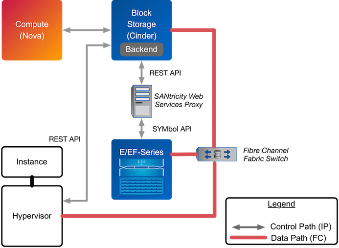

Configuration
=============

Cinder
------

Cinder is configured by changing the contents of the ``cinder.conf``
file and restarting all of the Cinder processes. Depending on the
OpenStack distribution used, this may require issuing commands such as
``service openstack-cinder-api restart`` or
``service cinder-api restart``.

The ``cinder.conf`` file contains a set of configuration options (one
per line), specified as ``option_name``\ =value. Configuration options
are grouped together into a stanza, denoted by ``[stanza_name]``. There
must be at least one stanza named ``[DEFAULT]`` that contains
configuration parameters that apply generically to Cinder (and not to
any particular backend). Configuration options that are associated with
a particular Cinder backend should be placed in a separate stanza.

    **Note**

    While it is possible to specify driver-specific configuration
    options within the ``[DEFAULT]`` stanza, you are unable to define
    multiple Cinder backends within the ``[DEFAULT]`` stanza. NetApp
    strongly recommends that you specify driver-specific configuration
    in separate named stanzas, being sure to list the backends that
    should be enabled as the value for the configuration option
    ``enabled_backends``; for example:

    ::

        enabled_backends=myNfsBackend,myIscsiBackend,myFCBackend,myESeriesBackend
                        

    The ``enabled_backends`` option should be specified within the
    ``[DEFAULT]`` configuration stanza.

NetApp Data ONTAP Drivers for OpenStack Block Storage (Cinder)
--------------------------------------------------------------

NetApp drivers for clustered Data ONTAP and Data ONTAP operating in
7-Mode are now offered in a single, unified driver. The unified driver
provides OpenStack with access to NetApp clustered Data ONTAP and Data
ONTAP operating in 7-Mode controllers for provisioning and maintaining
OpenStack block storage volumes.

NetApp’s contribution strategy involves adding all new capabilities
directly into the upstream OpenStack Block Storage repositories, so all
the features are available regardless of which distribution you choose
when deploying OpenStack. Bug fixes are delivered into the appropriate
branches that represent the different releases of OpenStack (e.g.
``trunk``, ``stable/icehouse``, ``stable/havana``, etc).

On occasion, it may be necessary for NetApp to deliver capability to a
previous release of OpenStack that can not be accepted in the upstream
OpenStack repositories. In that case, we post the capability at the
NetApp Github repository - accessible at
https://github.com/NetApp/cinder. Be sure to choose the branch from this
repository that matches the release version of OpenStack you are
deploying with.

A variety of OpenStack block storage deployment options for NetApp Data
ONTAP based systems are available in the Kilo OpenStack release and
involve making deployment choices between the following:

-  Clustered Data ONTAP or Data ONTAP operating in 7-Mode

-  iSCSI, Fibre Channel, or NFS storage protocol

While there are multiple supported deployment options, since the Havana
release there is a new, single NetApp unified driver that can be
configured to achieve any of the desired deployments. In Grizzly and
prior releases, there were multiple drivers segmented by storage family,
protocol, and integration with additional NetApp management software.
The previous drivers have all been deprecated since the Havana release;
see `??? <#appendix.packaging.deprecation>`__ for more information on
the deprecated capabilities.

The following lists all of the individual options and subsequent
sections are intended to offer guidance on which configuration options
ought to be employed given varying use cases:

-  `NetApp clustered Data ONTAP with
   iSCSI <#cinder.cdot.iscsi.configuration>`__

-  `NetApp clustered Data ONTAP with
   NFS <#cinder.cdot.nfs.configuration>`__

-  `NetApp clustered Data ONTAP with Fibre
   Channel <#cinder.cdot.fc.configuration>`__

-  `NetApp Data ONTAP operating in 7-Mode with
   iSCSI <#cinder.7mode.iscsi.configuration>`__

-  `NetApp Data ONTAP operating in 7-Mode with
   NFS <#cinder.7mode.nfs.configuration>`__

-  `NetApp Data ONTAP operating in 7-Mode with Fibre
   Channel <#cinder.7mode.fc.configuration>`__

NetApp Unified Driver for Clustered Data ONTAP with iSCSI
---------------------------------------------------------

The NetApp unified driver for clustered Data ONTAP with iSCSI is a
driver interface from OpenStack Cinder to NetApp clustered Data ONTAP
storage controllers to accomplish provisioning and management of a
storage-area network (SAN) block storage entity; that is, a NetApp LUN
that uses the iSCSI protocol.

To set up the NetApp clustered Data ONTAP iSCSI driver for Cinder, the
following stanza should be added to the Cinder configuration file
(``cinder.conf``):

::

    [myIscsiBackend] 
    volume_backend_name=myIscsiBackend
    volume_driver=cinder.volume.drivers.netapp.common.NetAppDriver
    netapp_server_hostname=hostname
    netapp_server_port=80
    netapp_storage_protocol=iscsi 
    netapp_storage_family=ontap_cluster
    netapp_login=admin_username
    netapp_password=admin_password
    netapp_vserver=svm_name
    max_oversubscription_ratio=1.0
    reserved_percentage=5
    use_multipath_for_image_xfer = True
                

-  Be sure that the value of the ``enabled_backends`` option in the
   ``[DEFAULT]`` stanza includes the name of the stanza you chose for
   the backend.

-  The value of ``netapp_storage_protocol`` MUST be set to ``iscsi``.

`table\_title <#cinder.cdot.iscsi.options>`__ lists the configuration
options available for the unified driver for a clustered Data ONTAP
deployment that uses the iSCSI storage protocol.

+---------------------------------------+------------+---------------------+------------------------------------------------------------------------------------------------------------------------------------------------------------------------------------------------------------------------------------------------------------------------------------------------------------------------------------------------------------------------------------------------------------------------------------------------------------------------------------------------------------------------------------------------------------------------------------------------------------------------------------------------------------------------------------------------------------------------------------------------------------------------------------------------------------------------------------------------------+
| Option                                | Type       | Default Value       | Description                                                                                                                                                                                                                                                                                                                                                                                                                                                                                                                                                                                                                                                                                                                                                                                                                                          |
+=======================================+============+=====================+======================================================================================================================================================================================================================================================================================================================================================================================================================================================================================================================================================================================================================================================================================================================================================================================================================================================+
| ``netapp_server_hostname``            | Required   |                     | The hostname or IP address for the storage system or proxy server. *The value of this option should be the IP address of either the cluster management LIF or the SVM management LIF.*                                                                                                                                                                                                                                                                                                                                                                                                                                                                                                                                                                                                                                                               |
+---------------------------------------+------------+---------------------+------------------------------------------------------------------------------------------------------------------------------------------------------------------------------------------------------------------------------------------------------------------------------------------------------------------------------------------------------------------------------------------------------------------------------------------------------------------------------------------------------------------------------------------------------------------------------------------------------------------------------------------------------------------------------------------------------------------------------------------------------------------------------------------------------------------------------------------------------+
| ``netapp_server_port``                | Optional   |                     | The TCP port to use for communication with the storage system or proxy server. If not specified, Data ONTAP drivers will use 80 for HTTP and 443 for HTTPS; E-Series will use 8080 for HTTP and 8443 for HTTPS.                                                                                                                                                                                                                                                                                                                                                                                                                                                                                                                                                                                                                                      |
+---------------------------------------+------------+---------------------+------------------------------------------------------------------------------------------------------------------------------------------------------------------------------------------------------------------------------------------------------------------------------------------------------------------------------------------------------------------------------------------------------------------------------------------------------------------------------------------------------------------------------------------------------------------------------------------------------------------------------------------------------------------------------------------------------------------------------------------------------------------------------------------------------------------------------------------------------+
| ``netapp_login``                      | Required   |                     | Administrative user account name used to access the storage system or proxy server.                                                                                                                                                                                                                                                                                                                                                                                                                                                                                                                                                                                                                                                                                                                                                                  |
+---------------------------------------+------------+---------------------+------------------------------------------------------------------------------------------------------------------------------------------------------------------------------------------------------------------------------------------------------------------------------------------------------------------------------------------------------------------------------------------------------------------------------------------------------------------------------------------------------------------------------------------------------------------------------------------------------------------------------------------------------------------------------------------------------------------------------------------------------------------------------------------------------------------------------------------------------+
| ``netapp_password``                   | Required   |                     | Password for the administrative user account specified in the ``netapp_login`` option.                                                                                                                                                                                                                                                                                                                                                                                                                                                                                                                                                                                                                                                                                                                                                               |
+---------------------------------------+------------+---------------------+------------------------------------------------------------------------------------------------------------------------------------------------------------------------------------------------------------------------------------------------------------------------------------------------------------------------------------------------------------------------------------------------------------------------------------------------------------------------------------------------------------------------------------------------------------------------------------------------------------------------------------------------------------------------------------------------------------------------------------------------------------------------------------------------------------------------------------------------------+
| ``netapp_storage_protocol``           | Required   |                     | The storage protocol to be used. Valid options are ``nfs``, ``iscsi``, or ``fc``.                                                                                                                                                                                                                                                                                                                                                                                                                                                                                                                                                                                                                                                                                                                                                                    |
+---------------------------------------+------------+---------------------+------------------------------------------------------------------------------------------------------------------------------------------------------------------------------------------------------------------------------------------------------------------------------------------------------------------------------------------------------------------------------------------------------------------------------------------------------------------------------------------------------------------------------------------------------------------------------------------------------------------------------------------------------------------------------------------------------------------------------------------------------------------------------------------------------------------------------------------------------+
| ``netapp_transport_type``             | Required   | ``http``            | Transport protocol for communicating with the storage system or proxy server. Valid options include ``http`` and ``https``.                                                                                                                                                                                                                                                                                                                                                                                                                                                                                                                                                                                                                                                                                                                          |
+---------------------------------------+------------+---------------------+------------------------------------------------------------------------------------------------------------------------------------------------------------------------------------------------------------------------------------------------------------------------------------------------------------------------------------------------------------------------------------------------------------------------------------------------------------------------------------------------------------------------------------------------------------------------------------------------------------------------------------------------------------------------------------------------------------------------------------------------------------------------------------------------------------------------------------------------------+
| ``netapp_size_multiplier``            | Optional   | 1.2                 | When creating volumes, the quantity to be multiplied to the requested OpenStack volume size to ensure enough space is available on the SVM (aka Vserver). *This value is currently only used when ISCSI has been selected as the storage protocol to be used. Deprecated - use reserved\_percentage instead.*                                                                                                                                                                                                                                                                                                                                                                                                                                                                                                                                        |
+---------------------------------------+------------+---------------------+------------------------------------------------------------------------------------------------------------------------------------------------------------------------------------------------------------------------------------------------------------------------------------------------------------------------------------------------------------------------------------------------------------------------------------------------------------------------------------------------------------------------------------------------------------------------------------------------------------------------------------------------------------------------------------------------------------------------------------------------------------------------------------------------------------------------------------------------------+
| ``netapp_vserver``                    | Required   |                     | This option specifies the storage virtual machine (previously called a Vserver) name on the storage cluster on which provisioning of block storage volumes should occur.                                                                                                                                                                                                                                                                                                                                                                                                                                                                                                                                                                                                                                                                             |
+---------------------------------------+------------+---------------------+------------------------------------------------------------------------------------------------------------------------------------------------------------------------------------------------------------------------------------------------------------------------------------------------------------------------------------------------------------------------------------------------------------------------------------------------------------------------------------------------------------------------------------------------------------------------------------------------------------------------------------------------------------------------------------------------------------------------------------------------------------------------------------------------------------------------------------------------------+
| ``netapp_storage_family``             | Optional   | ``ontap_cluster``   | The storage family type used on the storage system; valid values are ``ontap_7mode`` for Data ONTAP operating in 7-Mode, ``ontap_cluster`` for clustered Data ONTAP, or ``eseries`` for E-Series.                                                                                                                                                                                                                                                                                                                                                                                                                                                                                                                                                                                                                                                    |
+---------------------------------------+------------+---------------------+------------------------------------------------------------------------------------------------------------------------------------------------------------------------------------------------------------------------------------------------------------------------------------------------------------------------------------------------------------------------------------------------------------------------------------------------------------------------------------------------------------------------------------------------------------------------------------------------------------------------------------------------------------------------------------------------------------------------------------------------------------------------------------------------------------------------------------------------------+
| ``netapp_lun_ostype``                 | Optional   | ``linux``           | This option defines the type of operating system that will access a LUN exported from Data ONTAP; it is assigned to the LUN at the time it is created.                                                                                                                                                                                                                                                                                                                                                                                                                                                                                                                                                                                                                                                                                               |
+---------------------------------------+------------+---------------------+------------------------------------------------------------------------------------------------------------------------------------------------------------------------------------------------------------------------------------------------------------------------------------------------------------------------------------------------------------------------------------------------------------------------------------------------------------------------------------------------------------------------------------------------------------------------------------------------------------------------------------------------------------------------------------------------------------------------------------------------------------------------------------------------------------------------------------------------------+
| ``netapp_lun_space_reservation``      | Optional   | ``enabled``         | This option specifies whether space will be reserved when creating Cinder volumes on NetApp backends using the iSCSI or FC storage protocols. If this option is set to ``enabled``, LUNs created during volume creation or volume cloning workflows will always be thick provisioned. If this option is set to ``disabled``, LUNs created during volume creation or volume cloning workflows will always be thin provisioned. Note that this option does not affect the implementation of Cinder snapshots, where the LUN clone that represents the snapshot will always be thin provisioned. Valid options are ``enabled`` and ``disabled``.                                                                                                                                                                                                        |
+---------------------------------------+------------+---------------------+------------------------------------------------------------------------------------------------------------------------------------------------------------------------------------------------------------------------------------------------------------------------------------------------------------------------------------------------------------------------------------------------------------------------------------------------------------------------------------------------------------------------------------------------------------------------------------------------------------------------------------------------------------------------------------------------------------------------------------------------------------------------------------------------------------------------------------------------------+
| ``netapp_host_type``                  | Optional   | ``linux``           | This option defines the type of operating system for all initiators that can access a LUN. This information is used when mapping LUNs to individual hosts or groups of hosts. For a list of valid OS types, refer to the `Data ONTAP documentation <https://library.netapp.com/ecmdocs/ECMP1196995/html/GUID-7D4DD6E3-DB77-4671-BDA2-E393002E9EB2.html>`__                                                                                                                                                                                                                                                                                                                                                                                                                                                                                           |
+---------------------------------------+------------+---------------------+------------------------------------------------------------------------------------------------------------------------------------------------------------------------------------------------------------------------------------------------------------------------------------------------------------------------------------------------------------------------------------------------------------------------------------------------------------------------------------------------------------------------------------------------------------------------------------------------------------------------------------------------------------------------------------------------------------------------------------------------------------------------------------------------------------------------------------------------------+
| ``reserved_percentage``               | Optional   | ``0``               | This option represents the amount of total capacity of a storage pool that will be reserved and cannot be utilized for provisioning Cinder volumes.                                                                                                                                                                                                                                                                                                                                                                                                                                                                                                                                                                                                                                                                                                  |
+---------------------------------------+------------+---------------------+------------------------------------------------------------------------------------------------------------------------------------------------------------------------------------------------------------------------------------------------------------------------------------------------------------------------------------------------------------------------------------------------------------------------------------------------------------------------------------------------------------------------------------------------------------------------------------------------------------------------------------------------------------------------------------------------------------------------------------------------------------------------------------------------------------------------------------------------------+
| ``max_oversubscription_ratio``        | Optional   | ``20.0``            | This option is defined as a float, and specifies the amount of over-provisioning to allow when thin provisioning is being used in the storage pool. A value of 1.0 will mean that the provisioned capacity will not be able to exceed the total capacity, while larger values will result in increased levels of allowed over-provisioning.                                                                                                                                                                                                                                                                                                                                                                                                                                                                                                          |
+---------------------------------------+------------+---------------------+------------------------------------------------------------------------------------------------------------------------------------------------------------------------------------------------------------------------------------------------------------------------------------------------------------------------------------------------------------------------------------------------------------------------------------------------------------------------------------------------------------------------------------------------------------------------------------------------------------------------------------------------------------------------------------------------------------------------------------------------------------------------------------------------------------------------------------------------------+
| ``netapp_pool_name_search_pattern``   | Optional   | ``(.+)``            | This option is only utilized when the Cinder driver is configured to use iSCSI or Fibre Channel. It is used to restrict provisioning to the specified FlexVol volumes. Specify the value of this option as a regular expression which will be applied to the names of FlexVol volumes from the storage backend which represent pools in Cinder. ``^`` (beginning of string) and ``$`` (end of string) are implicitly wrapped around the regular expression specified before filtering.                                                                                                                                                                                                                                                                                                                                                               |
+---------------------------------------+------------+---------------------+------------------------------------------------------------------------------------------------------------------------------------------------------------------------------------------------------------------------------------------------------------------------------------------------------------------------------------------------------------------------------------------------------------------------------------------------------------------------------------------------------------------------------------------------------------------------------------------------------------------------------------------------------------------------------------------------------------------------------------------------------------------------------------------------------------------------------------------------------+
| ``use_multipath_for_image_xfer``      | Optional   |                     | If multipath has been enabled on your OpenStack hosts, then setting this option to ``true`` will permit Cinder to use multiple paths for increased bandwidth. Use of this option is also contingent upon a modification to the Nova configuration file ``nova.conf``. The option ``iscsi_use_multipath = True`` must be added beneath the [libvirt] stanza contained within ``nova.conf``. The inclusion of these options will not affect your OpenStack deployment in the event that multipath is not properly configured on your OpenStack hosts. Consult `Recommended host settings for Linux Unified Host Utilities <https://library.netapp.com/ecm/ecm_download_file/ECMP1654939>`__ and `Linux Unified Host Utilities Guide <https://library.netapp.com/ecm/ecm_download_file/ECMP1654943>`__ to configure multipath on your OpenStack hosts   |
+---------------------------------------+------------+---------------------+------------------------------------------------------------------------------------------------------------------------------------------------------------------------------------------------------------------------------------------------------------------------------------------------------------------------------------------------------------------------------------------------------------------------------------------------------------------------------------------------------------------------------------------------------------------------------------------------------------------------------------------------------------------------------------------------------------------------------------------------------------------------------------------------------------------------------------------------------+
| ``filter_function``                   | Optional   | (see description)   | This option may be used to override the default filter function, which prevents Cinder from placing new volumes on storage controllers that may become overutilized. The default value is "capabilities.utilization < 70".                                                                                                                                                                                                                                                                                                                                                                                                                                                                                                                                                                                                                           |
+---------------------------------------+------------+---------------------+------------------------------------------------------------------------------------------------------------------------------------------------------------------------------------------------------------------------------------------------------------------------------------------------------------------------------------------------------------------------------------------------------------------------------------------------------------------------------------------------------------------------------------------------------------------------------------------------------------------------------------------------------------------------------------------------------------------------------------------------------------------------------------------------------------------------------------------------------+
| ``goodness_function``                 | Optional   | (see description)   | This option may be used to override the default goodness function, which allows Cinder to place new volumes on lesser-utilized storage controllers. The default value is "100 - capabilities.utilization".                                                                                                                                                                                                                                                                                                                                                                                                                                                                                                                                                                                                                                           |
+---------------------------------------+------------+---------------------+------------------------------------------------------------------------------------------------------------------------------------------------------------------------------------------------------------------------------------------------------------------------------------------------------------------------------------------------------------------------------------------------------------------------------------------------------------------------------------------------------------------------------------------------------------------------------------------------------------------------------------------------------------------------------------------------------------------------------------------------------------------------------------------------------------------------------------------------------+
| ``use_chap_auth``                     | Optional   | ````                | This option is defined as a boolean, and specifies if unidirectional CHAP is enabled. Provides authenticated communication between iSCSI initiators and targets. For Data ONTAP the TCP port 22 (SSH) on the cluster management LIF must be open and available to set CHAP authentication credentials on the storage system.                                                                                                                                                                                                                                                                                                                                                                                                                                                                                                                         |
+---------------------------------------+------------+---------------------+------------------------------------------------------------------------------------------------------------------------------------------------------------------------------------------------------------------------------------------------------------------------------------------------------------------------------------------------------------------------------------------------------------------------------------------------------------------------------------------------------------------------------------------------------------------------------------------------------------------------------------------------------------------------------------------------------------------------------------------------------------------------------------------------------------------------------------------------------+

Table: Configuration options for clustered Data ONTAP with iSCSI

    **Caution**

    If you specify an account in the ``netapp_login`` option that only
    has SVM administration privileges (rather than cluster
    administration privileges), some advanced features of the NetApp
    unified driver will not work and you may see warnings in the Cinder
    logs. See `simplesect\_title <#cinder.cdot.account_permissions>`__
    for more details on the required access level permissions for an SVM
    admin account.

NetApp Unified Driver for Clustered Data ONTAP with NFS
-------------------------------------------------------

The NetApp unifed driver for clustered Data ONTAP with NFS is a driver
interface from OpenStack block storage to a Data ONTAP cluster system to
accomplish provisioning and management of OpenStack volumes on NFS
exports provided by the Data ONTAP cluster system. The NetApp unified
driver for the Data ONTAP cluster does not require any additional
management software to achieve the desired functionality. It uses NetApp
APIs to interact with the Data ONTAP cluster.

To set up the NetApp clustered Data ONTAP NFS driver for Cinder, the
following stanza should be added to the Cinder configuration file
(``cinder.conf``):

::

    [myNfsBackend] 
    volume_backend_name=myNfsBackend
    volume_driver=cinder.volume.drivers.netapp.common.NetAppDriver
    netapp_server_hostname=hostname
    netapp_server_port=80
    netapp_storage_protocol=nfs
    netapp_storage_family=ontap_cluster
    netapp_login=admin_username
    netapp_password=admin_password
    netapp_vserver=svm_name
    nfs_shares_config=path_to_nfs_exports_file
    max_oversubscription_ratio=1.0
    reserved_percentage=5
                

-  Be sure that the value of the ``enabled_backends`` option in the
   ``[DEFAULT]`` stanza includes the name of the stanza you chose for
   the backend.

    **Caution**

    Please note that exported qtrees are not supported by Cinder.

    **Note**

    The file referenced in the ``nfs_shares_config`` configuration
    option should contain the NFS exports in the ``ip:/share`` format,
    for example:

    ::

        10.63.165.215:/nfs/test
        10.63.165.215:/nfs2/test2

    where ``ip`` corresponds to the IP address assigned to a Data LIF,
    and ``share`` refers to a junction path for a FlexVol volume within
    an SVM. Make sure that volumes corresponding to exports have
    read/write permissions set on the Data ONTAP controllers. Do *not*
    put mount options in the ``nfs_shares_config`` file; use
    ``nfs_mount_options`` instead. For more information on that and
    other parameters available to affect the behavior of NetApp's NFS
    driver, please refer to
    http://docs.openstack.org/trunk/config-reference/content/nfs-driver-options.html.

`table\_title <#cinder.cdot.nfs.options>`__ lists the configuration
options available for the unified driver for a clustered Data ONTAP
deployment that uses the NFS storage protocol.

+------------------------------------+------------+------------------------------+-------------------------------------------------------------------------------------------------------------------------------------------------------------------------------------------------------------------------------------------------------------------------------------------------------------------------------------------------------------------------------------------------------------------------+
| Option                             | Type       | Default Value                | Description                                                                                                                                                                                                                                                                                                                                                                                                             |
+====================================+============+==============================+=========================================================================================================================================================================================================================================================================================================================================================================================================================+
| ``netapp_server_hostname``         | Required   |                              | The hostname or IP address for the storage system or proxy server. *The value of this option should be the IP address of either the cluster management LIF or the SVM management LIF.*                                                                                                                                                                                                                                  |
+------------------------------------+------------+------------------------------+-------------------------------------------------------------------------------------------------------------------------------------------------------------------------------------------------------------------------------------------------------------------------------------------------------------------------------------------------------------------------------------------------------------------------+
| ``netapp_server_port``             | Optional   |                              | The TCP port to use for communication with the storage system or proxy server. If not specified, Data ONTAP drivers will use 80 for HTTP and 443 for HTTPS; E-Series will use 8080 for HTTP and 8443 for HTTPS.                                                                                                                                                                                                         |
+------------------------------------+------------+------------------------------+-------------------------------------------------------------------------------------------------------------------------------------------------------------------------------------------------------------------------------------------------------------------------------------------------------------------------------------------------------------------------------------------------------------------------+
| ``netapp_login``                   | Required   |                              | Administrative user account name used to access the storage system or proxy server.                                                                                                                                                                                                                                                                                                                                     |
+------------------------------------+------------+------------------------------+-------------------------------------------------------------------------------------------------------------------------------------------------------------------------------------------------------------------------------------------------------------------------------------------------------------------------------------------------------------------------------------------------------------------------+
| ``netapp_password``                | Required   |                              | Password for the administrative user account specified in the ``netapp_login`` option.                                                                                                                                                                                                                                                                                                                                  |
+------------------------------------+------------+------------------------------+-------------------------------------------------------------------------------------------------------------------------------------------------------------------------------------------------------------------------------------------------------------------------------------------------------------------------------------------------------------------------------------------------------------------------+
| ``netapp_storage_protocol``        | Required   |                              | The storage protocol to be used. Valid options are ``nfs``, ``iscsi``, or ``fc``.                                                                                                                                                                                                                                                                                                                                       |
+------------------------------------+------------+------------------------------+-------------------------------------------------------------------------------------------------------------------------------------------------------------------------------------------------------------------------------------------------------------------------------------------------------------------------------------------------------------------------------------------------------------------------+
| ``netapp_transport_type``          | Required   | ``http``                     | Transport protocol for communicating with the storage system or proxy server. Valid options include ``http`` and ``https``.                                                                                                                                                                                                                                                                                             |
+------------------------------------+------------+------------------------------+-------------------------------------------------------------------------------------------------------------------------------------------------------------------------------------------------------------------------------------------------------------------------------------------------------------------------------------------------------------------------------------------------------------------------+
| ``netapp_copyoffload_tool_path``   | Optional   |                              | This option specifies the path of the NetApp copy offload tool binary. Ensure that the binary has execute permissions set which allow the effective user of the ``cinder-volume`` process to execute the file.                                                                                                                                                                                                          |
+------------------------------------+------------+------------------------------+-------------------------------------------------------------------------------------------------------------------------------------------------------------------------------------------------------------------------------------------------------------------------------------------------------------------------------------------------------------------------------------------------------------------------+
| ``netapp_vserver``                 | Required   |                              | This option specifies the storage virtual machine (previously called a Vserver) name on the storage cluster on which provisioning of block storage volumes should occur.                                                                                                                                                                                                                                                |
+------------------------------------+------------+------------------------------+-------------------------------------------------------------------------------------------------------------------------------------------------------------------------------------------------------------------------------------------------------------------------------------------------------------------------------------------------------------------------------------------------------------------------+
| ``netapp_storage_family``          | Optional   | ``ontap_cluster``            | The storage family type used on the storage system; valid values are ``ontap_7mode`` for Data ONTAP operating in 7-Mode, ``ontap_cluster`` for clustered Data ONTAP, or ``eseries`` for E-Series.                                                                                                                                                                                                                       |
+------------------------------------+------------+------------------------------+-------------------------------------------------------------------------------------------------------------------------------------------------------------------------------------------------------------------------------------------------------------------------------------------------------------------------------------------------------------------------------------------------------------------------+
| ``nfs_shares_config``              | Required   | ``/etc/cinder/nfs_shares``   | The file referenced by this configuration option should contain a list of NFS shares, each on their own line, to which the driver should attempt to provision new Cinder volumes into.                                                                                                                                                                                                                                  |
+------------------------------------+------------+------------------------------+-------------------------------------------------------------------------------------------------------------------------------------------------------------------------------------------------------------------------------------------------------------------------------------------------------------------------------------------------------------------------------------------------------------------------+
| ``nfs_mount_options``              | Optional   | None                         | Mount options passed to the nfs client. See section of the nfs man page for details.                                                                                                                                                                                                                                                                                                                                    |
+------------------------------------+------------+------------------------------+-------------------------------------------------------------------------------------------------------------------------------------------------------------------------------------------------------------------------------------------------------------------------------------------------------------------------------------------------------------------------------------------------------------------------+
| ``nas_secure_file_permissions``    | Optional   | ``auto``                     | If 'false', backing files for cinder volumes are readable by owner, group, and world; if 'true', only by owner and group. If 'auto' and there are existing Cinder volumes, value will be set to 'false' (for backwards compatibility); if 'auto' and there are no existing Cinder volumes, the value will be set to 'true'.                                                                                             |
+------------------------------------+------------+------------------------------+-------------------------------------------------------------------------------------------------------------------------------------------------------------------------------------------------------------------------------------------------------------------------------------------------------------------------------------------------------------------------------------------------------------------------+
| ``nas_secure_file_operations``     | Optional   | ``auto``                     | If 'false', operations on the backing files run as root; if 'true', operations on the backing files for cinder volumes run unprivileged, as the cinder user, and are allowed to succeed even when root is squashed. If 'auto' and there are existing Cinder volumes, value will be set to 'false' (for backwards compatibility); if 'auto' and there are no existing Cinder volumes, the value will be set to 'true'.   |
+------------------------------------+------------+------------------------------+-------------------------------------------------------------------------------------------------------------------------------------------------------------------------------------------------------------------------------------------------------------------------------------------------------------------------------------------------------------------------------------------------------------------------+
| ``thres_avl_size_perc_start``      | Optional   | 20                           | If the percentage of available space for an NFS share has dropped below the value specified by this option, the NFS image cache will be cleaned.                                                                                                                                                                                                                                                                        |
+------------------------------------+------------+------------------------------+-------------------------------------------------------------------------------------------------------------------------------------------------------------------------------------------------------------------------------------------------------------------------------------------------------------------------------------------------------------------------------------------------------------------------+
| ``thres_avl_size_perc_stop``       | Optional   | 60                           | When the percentage of available space on an NFS share has reached the percentage specified by this option, the driver will stop clearing files from the NFS image cache that have not been accessed in the last M minutes, where M is the value of the ``expiry_thres_minutes`` configuration option.                                                                                                                  |
+------------------------------------+------------+------------------------------+-------------------------------------------------------------------------------------------------------------------------------------------------------------------------------------------------------------------------------------------------------------------------------------------------------------------------------------------------------------------------------------------------------------------------+
| ``expiry_thres_minutes``           | Optional   | 720                          | This option specifies the threshold for last access time for images in the NFS image cache. When a cache cleaning cycle begins, images in the cache that have not been accessed in the last M minutes, where M is the value of this parameter, will be deleted from the cache to create free space on the NFS share.                                                                                                    |
+------------------------------------+------------+------------------------------+-------------------------------------------------------------------------------------------------------------------------------------------------------------------------------------------------------------------------------------------------------------------------------------------------------------------------------------------------------------------------------------------------------------------------+
| ``reserved_percentage``            | Optional   | ``0``                        | This option represents the amount of total capacity of a storage pool that will be reserved and cannot be utilized for provisioning Cinder volumes.                                                                                                                                                                                                                                                                     |
+------------------------------------+------------+------------------------------+-------------------------------------------------------------------------------------------------------------------------------------------------------------------------------------------------------------------------------------------------------------------------------------------------------------------------------------------------------------------------------------------------------------------------+
| ``max_oversubscription_ratio``     | Optional   | ``20.0``                     | This option is defined as a float, and specifies the amount of over-provisioning to allow when thin provisioning is being used in the storage pool. A value of 1.0 will mean that the provisioned capacity will not be able to exceed the total capacity, while larger values will result in increased levels of allowed over-provisioning.                                                                             |
+------------------------------------+------------+------------------------------+-------------------------------------------------------------------------------------------------------------------------------------------------------------------------------------------------------------------------------------------------------------------------------------------------------------------------------------------------------------------------------------------------------------------------+
| ``filter_function``                | Optional   | (see description)            | This option may be used to override the default filter function, which prevents Cinder from placing new volumes on storage controllers that may become overutilized. The default value is "capabilities.utilization < 70".                                                                                                                                                                                              |
+------------------------------------+------------+------------------------------+-------------------------------------------------------------------------------------------------------------------------------------------------------------------------------------------------------------------------------------------------------------------------------------------------------------------------------------------------------------------------------------------------------------------------+
| ``goodness_function``              | Optional   | (see description)            | This option may be used to override the default goodness function, which allows Cinder to place new volumes on lesser-utilized storage controllers. The default value is "100 - capabilities.utilization".                                                                                                                                                                                                              |
+------------------------------------+------------+------------------------------+-------------------------------------------------------------------------------------------------------------------------------------------------------------------------------------------------------------------------------------------------------------------------------------------------------------------------------------------------------------------------------------------------------------------------+

Table: Configuration options for clustered Data ONTAP with NFS

    **Caution**

    If you specify an account in the ``netapp_login`` option that only
    has SVM administration privileges (rather than cluster
    administration privileges), some advanced features of the NetApp
    unified driver will not work and you may see warnings in the Cinder
    logs. See `simplesect\_title <#cinder.cdot.account_permissions>`__
    for more details on the required access level permissions for an SVM
    admin account.

NetApp Unified Driver for Clustered Data ONTAP with Fibre Channel
-----------------------------------------------------------------

The NetApp unified driver for clustered Data ONTAP with Fibre Channel is
a driver interface from OpenStack Cinder to NetApp clustered Data ONTAP
storage controllers to accomplish provisioning and management of a
storage-area network (SAN) block storage entity; that is, a NetApp LUN
that uses the Fibre Channel protocol.

To set up the NetApp clustered Data ONTAP Fibre Channel driver for
Cinder, the following stanza should be added to the Cinder configuration
file (``cinder.conf``):

::

    [myFCBackend] 
    volume_backend_name=myFCBackend
    volume_driver=cinder.volume.drivers.netapp.common.NetAppDriver
    netapp_server_hostname=hostname
    netapp_server_port=80
    netapp_storage_protocol=fc 
    netapp_storage_family=ontap_cluster
    netapp_login=admin_username
    netapp_password=admin_password
    netapp_vserver=svm_name
    max_oversubscription_ratio=1.0
    reserved_percentage=5
                

-  Be sure that the value of the ``enabled_backends`` option in the
   ``[DEFAULT]`` stanza includes the name of the stanza you chose for
   the backend.

-  The value of ``netapp_storage_protocol`` MUST be set to ``fc``.

`table\_title <#cinder.cdot.fc.options>`__ lists the configuration
options available for the unified driver for a clustered Data ONTAP
deployment that uses the Fibre Channel storage protocol.

+---------------------------------------+------------+---------------------+-------------------------------------------------------------------------------------------------------------------------------------------------------------------------------------------------------------------------------------------------------------------------------------------------------------------------------------------------------------------------------------------------------------------------------------------------------------------------------------------------------------------------------------------------------------------------------------------------------------------------------------------------+
| Option                                | Type       | Default Value       | Description                                                                                                                                                                                                                                                                                                                                                                                                                                                                                                                                                                                                                                     |
+=======================================+============+=====================+=================================================================================================================================================================================================================================================================================================================================================================================================================================================================================================================================================================================================================================================+
| ``netapp_server_hostname``            | Required   |                     | The hostname or IP address for the storage system or proxy server. *The value of this option should be the IP address of either the cluster management LIF or the SVM management LIF.*                                                                                                                                                                                                                                                                                                                                                                                                                                                          |
+---------------------------------------+------------+---------------------+-------------------------------------------------------------------------------------------------------------------------------------------------------------------------------------------------------------------------------------------------------------------------------------------------------------------------------------------------------------------------------------------------------------------------------------------------------------------------------------------------------------------------------------------------------------------------------------------------------------------------------------------------+
| ``netapp_server_port``                | Optional   |                     | The TCP port to use for communication with the storage system or proxy server. If not specified, Data ONTAP drivers will use 80 for HTTP and 443 for HTTPS; E-Series will use 8080 for HTTP and 8443 for HTTPS.                                                                                                                                                                                                                                                                                                                                                                                                                                 |
+---------------------------------------+------------+---------------------+-------------------------------------------------------------------------------------------------------------------------------------------------------------------------------------------------------------------------------------------------------------------------------------------------------------------------------------------------------------------------------------------------------------------------------------------------------------------------------------------------------------------------------------------------------------------------------------------------------------------------------------------------+
| ``netapp_login``                      | Required   |                     | Administrative user account name used to access the storage system or proxy server.                                                                                                                                                                                                                                                                                                                                                                                                                                                                                                                                                             |
+---------------------------------------+------------+---------------------+-------------------------------------------------------------------------------------------------------------------------------------------------------------------------------------------------------------------------------------------------------------------------------------------------------------------------------------------------------------------------------------------------------------------------------------------------------------------------------------------------------------------------------------------------------------------------------------------------------------------------------------------------+
| ``netapp_password``                   | Required   |                     | Password for the administrative user account specified in the ``netapp_login`` option.                                                                                                                                                                                                                                                                                                                                                                                                                                                                                                                                                          |
+---------------------------------------+------------+---------------------+-------------------------------------------------------------------------------------------------------------------------------------------------------------------------------------------------------------------------------------------------------------------------------------------------------------------------------------------------------------------------------------------------------------------------------------------------------------------------------------------------------------------------------------------------------------------------------------------------------------------------------------------------+
| ``netapp_storage_protocol``           | Required   |                     | The storage protocol to be used. Valid options are ``nfs``, ``iscsi`` or ``fc``.                                                                                                                                                                                                                                                                                                                                                                                                                                                                                                                                                                |
+---------------------------------------+------------+---------------------+-------------------------------------------------------------------------------------------------------------------------------------------------------------------------------------------------------------------------------------------------------------------------------------------------------------------------------------------------------------------------------------------------------------------------------------------------------------------------------------------------------------------------------------------------------------------------------------------------------------------------------------------------+
| ``netapp_transport_type``             | Required   | ``http``            | Transport protocol for communicating with the storage system or proxy server. Valid options include ``http`` and ``https``.                                                                                                                                                                                                                                                                                                                                                                                                                                                                                                                     |
+---------------------------------------+------------+---------------------+-------------------------------------------------------------------------------------------------------------------------------------------------------------------------------------------------------------------------------------------------------------------------------------------------------------------------------------------------------------------------------------------------------------------------------------------------------------------------------------------------------------------------------------------------------------------------------------------------------------------------------------------------+
| ``netapp_size_multiplier``            | Optional   | 1.2                 | When creating volumes, the quantity to be multiplied to the requested OpenStack volume size to ensure enough space is available on the SVM (aka Vserver). *This value is currently only used when iSCSI has been selected as the storage protocol to be used.*                                                                                                                                                                                                                                                                                                                                                                                  |
+---------------------------------------+------------+---------------------+-------------------------------------------------------------------------------------------------------------------------------------------------------------------------------------------------------------------------------------------------------------------------------------------------------------------------------------------------------------------------------------------------------------------------------------------------------------------------------------------------------------------------------------------------------------------------------------------------------------------------------------------------+
| ``netapp_vserver``                    | Required   |                     | This option specifies the storage virtual machine (previously called a Vserver) name on the storage cluster on which provisioning of block storage volumes should occur.                                                                                                                                                                                                                                                                                                                                                                                                                                                                        |
+---------------------------------------+------------+---------------------+-------------------------------------------------------------------------------------------------------------------------------------------------------------------------------------------------------------------------------------------------------------------------------------------------------------------------------------------------------------------------------------------------------------------------------------------------------------------------------------------------------------------------------------------------------------------------------------------------------------------------------------------------+
| ``netapp_storage_family``             | Optional   | ``ontap_cluster``   | The storage family type used on the storage system; valid values are ``ontap_7mode`` for Data ONTAP operating in 7-Mode, ``ontap_cluster`` for clustered Data ONTAP, or ``eseries`` for E-Series.                                                                                                                                                                                                                                                                                                                                                                                                                                               |
+---------------------------------------+------------+---------------------+-------------------------------------------------------------------------------------------------------------------------------------------------------------------------------------------------------------------------------------------------------------------------------------------------------------------------------------------------------------------------------------------------------------------------------------------------------------------------------------------------------------------------------------------------------------------------------------------------------------------------------------------------+
| ``netapp_pool_name_search_pattern``   | Optional   | ``(.+)``            | This option is only utilized when the Cinder driver is configured to use iSCSI or Fibre Channel. It is used to restrict provisioning to the specified FlexVol volumes. Specify the value of this option as a regular expression which will be applied to the names of FlexVol volumes from the storage backend which represent pools in Cinder. ``^`` (beginning of string) and ``$`` (end of string) are implicitly wrapped around the regular expression specified before filtering.                                                                                                                                                          |
+---------------------------------------+------------+---------------------+-------------------------------------------------------------------------------------------------------------------------------------------------------------------------------------------------------------------------------------------------------------------------------------------------------------------------------------------------------------------------------------------------------------------------------------------------------------------------------------------------------------------------------------------------------------------------------------------------------------------------------------------------+
| ``netapp_lun_space_reservation``      | Optional   | ``enabled``         | This option specifies whether space will be reserved when creating Cinder volumes on NetApp backends using the iSCSI or FC storage protocols. If this option is set to ``enabled``, LUNs created during volume creation or volume cloning workflows will always be thick provisioned. If this option is set to ``disabled``, LUNs created during volume creation or volume cloning workflows will always be thin provisioned. Note that this option does not affect the implementation of Cinder snapshots, where the LUN clone that represents the snapshot will always be thin provisioned. Valid options are ``enabled`` and ``disabled``.   |
+---------------------------------------+------------+---------------------+-------------------------------------------------------------------------------------------------------------------------------------------------------------------------------------------------------------------------------------------------------------------------------------------------------------------------------------------------------------------------------------------------------------------------------------------------------------------------------------------------------------------------------------------------------------------------------------------------------------------------------------------------+
| ``reserved_percentage``               | Optional   | ``0``               | This option represents the amount of total capacity of a storage pool that will be reserved and cannot be utilized for provisioning Cinder volumes.                                                                                                                                                                                                                                                                                                                                                                                                                                                                                             |
+---------------------------------------+------------+---------------------+-------------------------------------------------------------------------------------------------------------------------------------------------------------------------------------------------------------------------------------------------------------------------------------------------------------------------------------------------------------------------------------------------------------------------------------------------------------------------------------------------------------------------------------------------------------------------------------------------------------------------------------------------+
| ``max_oversubscription_ratio``        | Optional   | ``20.0``            | This option is defined as a float, and specifies the amount of over-provisioning to allow when thin provisioning is being used in the storage pool. A value of 1.0 will mean that the provisioned capacity will not be able to exceed the total capacity, while larger values will result in increased levels of allowed over-provisioning.                                                                                                                                                                                                                                                                                                     |
+---------------------------------------+------------+---------------------+-------------------------------------------------------------------------------------------------------------------------------------------------------------------------------------------------------------------------------------------------------------------------------------------------------------------------------------------------------------------------------------------------------------------------------------------------------------------------------------------------------------------------------------------------------------------------------------------------------------------------------------------------+
| ``filter_function``                   | Optional   | (see description)   | This option may be used to override the default filter function, which prevents Cinder from placing new volumes on storage controllers that may become overutilized. The default value is "capabilities.utilization < 70".                                                                                                                                                                                                                                                                                                                                                                                                                      |
+---------------------------------------+------------+---------------------+-------------------------------------------------------------------------------------------------------------------------------------------------------------------------------------------------------------------------------------------------------------------------------------------------------------------------------------------------------------------------------------------------------------------------------------------------------------------------------------------------------------------------------------------------------------------------------------------------------------------------------------------------+
| ``goodness_function``                 | Optional   | (see description)   | This option may be used to override the default goodness function, which allows Cinder to place new volumes on lesser-utilized storage controllers. The default value is "100 - capabilities.utilization".                                                                                                                                                                                                                                                                                                                                                                                                                                      |
+---------------------------------------+------------+---------------------+-------------------------------------------------------------------------------------------------------------------------------------------------------------------------------------------------------------------------------------------------------------------------------------------------------------------------------------------------------------------------------------------------------------------------------------------------------------------------------------------------------------------------------------------------------------------------------------------------------------------------------------------------+

Table: Configuration options for clustered Data ONTAP with Fibre Channel

    **Caution**

    If you specify an account in the ``netapp_login`` option that only
    has SVM administration privileges (rather than cluster
    administration privileges), some advanced features of the NetApp
    unified driver will not work and you may see warnings in the Cinder
    logs. See `simplesect\_title <#cinder.cdot.account_permissions>`__
    for more details on the required access level permissions for an SVM
    admin account.

    **Important**

    In order for Fibre Channel to be set up correctly, you also need to
    set up Fibre Channel zoning for your backends. See
    `??? <#cinder.fc_zoning>`__ for more details on configuring Fibre
    Channel zoning.

NetApp Unified Driver for Data ONTAP operating in 7-Mode with iSCSI
-------------------------------------------------------------------

The NetApp unified driver for Data ONTAP operating in 7-Mode with iSCSI
is a driver interface from OpenStack Cinder to NetApp Data ONTAP
operating in 7-Mode storage controllers to accomplish provisioning and
management of a storage-area network (SAN) block storage entity; that
is, a NetApp LUN that uses the iSCSI protocol.

    **Important**

    The NetApp unified driver in Cinder currently provides integration
    for two major generations of the ONTAP operating system: the current
    “clustered” ONTAP and the legacy 7-mode. NetApp’s “full support” for
    7-mode ended in August of 2015 and the current “limited support”
    period will end in February of 2017 [1].

    In accordance with community policy [2], we are initiating the
    deprecation process for the 7-mode components of the Cinder NetApp
    unified driver set to conclude with their removal in the Queens
    release. This will apply to all three protocols currently supported
    in this driver: iSCSI, FC and NFS.

    -  ``What is being deprecated:`` Cinder drivers for NetApp Data
       ONTAP 7-mode NFS, iSCSI, FC

    -  ``Period of deprecation:`` 7-mode drivers will be around in
       stable/ocata and stable/pike and will be removed in the Queens
       release (All milestones of this release)

    -  ``What should users/operators do:`` Follow the recommended
       migration path to upgrade to Clustered Data ONTAP [3] or get in
       touch with your NetApp support representative.

    1. `Transition Fundamentals and
       Guidance <https://transition.netapp.com/>`__

    2. `OpenStack deprecation
       policy <https://governance.openstack.org/tc/reference/tags/assert_follows-standard-deprecation.html>`__

    3. `Clustered Data ONTAP for 7-Mode
       Administrators <https://mysupport.netapp.com/info/web/ECMP1658253.html>`__

To set up the NetApp Data ONTAP operating in 7-Mode iSCSI driver for
Cinder, the following stanza should be added to the Cinder configuration
file (``cinder.conf``):

::

    [myIscsiBackend] 
    volume_backend_name=myIscsiBackend
    volume_driver=cinder.volume.drivers.netapp.common.NetAppDriver
    netapp_server_hostname=hostname
    netapp_server_port=80
    netapp_storage_protocol=iscsi 
    netapp_storage_family=ontap_7mode 
    netapp_login=admin_username
    netapp_password=admin_password
    use_multipath_for_image_xfer=True
    max_oversubscription_ratio=1.0
    reserved_percentage=5
                

-  Be sure that the value of the ``enabled_backends`` option in the
   ``[DEFAULT]`` stanza includes the name of the stanza you chose for
   the backend.

-  The value of ``netapp_storage_protocol`` MUST be set to ``iscsi``.

-  The value of ``netapp_storage_family`` MUST be set to
   ``ontap_7mode``, as the default value for this option is
   ``ontap_cluster``.

`table\_title <#cinder.7mode.iscsi.options>`__ lists the configuration
options available for the unified driver for a clustered Data ONTAP
deployment that uses the iSCSI storage protocol.

+---------------------------------------+--------------+---------------------+------------------------------------------------------------------------------------------------------------------------------------------------------------------------------------------------------------------------------------------------------------------------------------------------------------------------------------------------------------------------------------------------------------------------------------------------------------------------------------------------------------------------------------------------------------------------------------------------------------------------------------------------------------------------------------------------------------------------------------------------------------------------------------------------------------------------------------------------------+
| Option                                | Type         | Default Value       | Description                                                                                                                                                                                                                                                                                                                                                                                                                                                                                                                                                                                                                                                                                                                                                                                                                                          |
+=======================================+==============+=====================+======================================================================================================================================================================================================================================================================================================================================================================================================================================================================================================================================================================================================================================================================================================================================================================================================================================================+
| ``netapp_server_hostname``            | Required     |                     | The hostname or IP address for the storage system or proxy server. *The value of this option should be the IP address of either the cluster management LIF or the SVM management LIF.*                                                                                                                                                                                                                                                                                                                                                                                                                                                                                                                                                                                                                                                               |
+---------------------------------------+--------------+---------------------+------------------------------------------------------------------------------------------------------------------------------------------------------------------------------------------------------------------------------------------------------------------------------------------------------------------------------------------------------------------------------------------------------------------------------------------------------------------------------------------------------------------------------------------------------------------------------------------------------------------------------------------------------------------------------------------------------------------------------------------------------------------------------------------------------------------------------------------------------+
| ``netapp_server_port``                | Optional     |                     | The TCP port to use for communication with the storage system or proxy server. If not specified, Data ONTAP drivers will use 80 for HTTP and 443 for HTTPS; E-Series will use 8080 for HTTP and 8443 for HTTPS.                                                                                                                                                                                                                                                                                                                                                                                                                                                                                                                                                                                                                                      |
+---------------------------------------+--------------+---------------------+------------------------------------------------------------------------------------------------------------------------------------------------------------------------------------------------------------------------------------------------------------------------------------------------------------------------------------------------------------------------------------------------------------------------------------------------------------------------------------------------------------------------------------------------------------------------------------------------------------------------------------------------------------------------------------------------------------------------------------------------------------------------------------------------------------------------------------------------------+
| ``netapp_login``                      | Required     |                     | Administrative user account name used to access the storage system or proxy server.                                                                                                                                                                                                                                                                                                                                                                                                                                                                                                                                                                                                                                                                                                                                                                  |
+---------------------------------------+--------------+---------------------+------------------------------------------------------------------------------------------------------------------------------------------------------------------------------------------------------------------------------------------------------------------------------------------------------------------------------------------------------------------------------------------------------------------------------------------------------------------------------------------------------------------------------------------------------------------------------------------------------------------------------------------------------------------------------------------------------------------------------------------------------------------------------------------------------------------------------------------------------+
| ``netapp_password``                   | Required     |                     | Password for the administrative user account specified in the ``netapp_login`` option.                                                                                                                                                                                                                                                                                                                                                                                                                                                                                                                                                                                                                                                                                                                                                               |
+---------------------------------------+--------------+---------------------+------------------------------------------------------------------------------------------------------------------------------------------------------------------------------------------------------------------------------------------------------------------------------------------------------------------------------------------------------------------------------------------------------------------------------------------------------------------------------------------------------------------------------------------------------------------------------------------------------------------------------------------------------------------------------------------------------------------------------------------------------------------------------------------------------------------------------------------------------+
| ``netapp_storage_protocol``           | Required     |                     | The storage protocol to be used. Valid options are ``nfs`` or ``iscsi``.                                                                                                                                                                                                                                                                                                                                                                                                                                                                                                                                                                                                                                                                                                                                                                             |
+---------------------------------------+--------------+---------------------+------------------------------------------------------------------------------------------------------------------------------------------------------------------------------------------------------------------------------------------------------------------------------------------------------------------------------------------------------------------------------------------------------------------------------------------------------------------------------------------------------------------------------------------------------------------------------------------------------------------------------------------------------------------------------------------------------------------------------------------------------------------------------------------------------------------------------------------------------+
| ``netapp_transport_type``             | Required     | ``http``            | Transport protocol for communicating with the storage system or proxy server. Valid options include ``http`` and ``https``.                                                                                                                                                                                                                                                                                                                                                                                                                                                                                                                                                                                                                                                                                                                          |
+---------------------------------------+--------------+---------------------+------------------------------------------------------------------------------------------------------------------------------------------------------------------------------------------------------------------------------------------------------------------------------------------------------------------------------------------------------------------------------------------------------------------------------------------------------------------------------------------------------------------------------------------------------------------------------------------------------------------------------------------------------------------------------------------------------------------------------------------------------------------------------------------------------------------------------------------------------+
| ``netapp_size_multiplier``            | Optional     | 1.2                 | When creating volumes, the quantity to be multiplied to the requested OpenStack volume size to ensure enough space is available on the SVM (aka Vserver). *This value is currently only used when ISCSI has been selected as the storage protocol to be used.*                                                                                                                                                                                                                                                                                                                                                                                                                                                                                                                                                                                       |
+---------------------------------------+--------------+---------------------+------------------------------------------------------------------------------------------------------------------------------------------------------------------------------------------------------------------------------------------------------------------------------------------------------------------------------------------------------------------------------------------------------------------------------------------------------------------------------------------------------------------------------------------------------------------------------------------------------------------------------------------------------------------------------------------------------------------------------------------------------------------------------------------------------------------------------------------------------+
| ``netapp_volume_list``                | Deprecated   |                     | This option has been deprecated in preference of ``netapp_pool_name_search_pattern``. Backwards compatibility for this option remains, but this option will be removed in a future release of OpenStack.                                                                                                                                                                                                                                                                                                                                                                                                                                                                                                                                                                                                                                             |
+---------------------------------------+--------------+---------------------+------------------------------------------------------------------------------------------------------------------------------------------------------------------------------------------------------------------------------------------------------------------------------------------------------------------------------------------------------------------------------------------------------------------------------------------------------------------------------------------------------------------------------------------------------------------------------------------------------------------------------------------------------------------------------------------------------------------------------------------------------------------------------------------------------------------------------------------------------+
| ``netapp_vfiler``                     | Optional     |                     | The vFiler unit on which provisioning of block storage volumes will be done. This option is only used by the driver when connecting to an instance with a storage family of Data ONTAP operating in 7-Mode. Only use this option when utilizing the MultiStore feature on the NetApp storage system.                                                                                                                                                                                                                                                                                                                                                                                                                                                                                                                                                 |
+---------------------------------------+--------------+---------------------+------------------------------------------------------------------------------------------------------------------------------------------------------------------------------------------------------------------------------------------------------------------------------------------------------------------------------------------------------------------------------------------------------------------------------------------------------------------------------------------------------------------------------------------------------------------------------------------------------------------------------------------------------------------------------------------------------------------------------------------------------------------------------------------------------------------------------------------------------+
| ``netapp_storage_family``             | Required     | ``ontap_cluster``   | The storage family type used on the storage system; valid values are ``ontap_7mode`` for Data ONTAP operating in 7-Mode, ``ontap_cluster`` for clustered Data ONTAP, or ``eseries`` for E-Series.                                                                                                                                                                                                                                                                                                                                                                                                                                                                                                                                                                                                                                                    |
+---------------------------------------+--------------+---------------------+------------------------------------------------------------------------------------------------------------------------------------------------------------------------------------------------------------------------------------------------------------------------------------------------------------------------------------------------------------------------------------------------------------------------------------------------------------------------------------------------------------------------------------------------------------------------------------------------------------------------------------------------------------------------------------------------------------------------------------------------------------------------------------------------------------------------------------------------------+
| ``netapp_lun_ostype``                 | Optional     | ``linux``           | This option defines the type of operating system that will access a LUN exported from Data ONTAP; it is assigned to the LUN at the time it is created.                                                                                                                                                                                                                                                                                                                                                                                                                                                                                                                                                                                                                                                                                               |
+---------------------------------------+--------------+---------------------+------------------------------------------------------------------------------------------------------------------------------------------------------------------------------------------------------------------------------------------------------------------------------------------------------------------------------------------------------------------------------------------------------------------------------------------------------------------------------------------------------------------------------------------------------------------------------------------------------------------------------------------------------------------------------------------------------------------------------------------------------------------------------------------------------------------------------------------------------+
| ``netapp_lun_space_reservation``      | Optional     | ``enabled``         | This option specifies whether space will be reserved when creating Cinder volumes on NetApp backends using the iSCSI or FC storage protocols. If this option is set to ``enabled``, LUNs created during volume creation or volume cloning workflows will always be thick provisioned. If this option is set to ``disabled``, LUNs created during volume creation or volume cloning workflows will always be thin provisioned. Note that this option does not affect the implementation of Cinder snapshots, where the LUN clone that represents the snapshot will always be thin provisioned. Valid options are ``enabled`` and ``disabled``.                                                                                                                                                                                                        |
+---------------------------------------+--------------+---------------------+------------------------------------------------------------------------------------------------------------------------------------------------------------------------------------------------------------------------------------------------------------------------------------------------------------------------------------------------------------------------------------------------------------------------------------------------------------------------------------------------------------------------------------------------------------------------------------------------------------------------------------------------------------------------------------------------------------------------------------------------------------------------------------------------------------------------------------------------------+
| ``netapp_host_type``                  | Optional     | ``linux``           | This option defines the type of operating system for all initiators that can access a LUN. This information is used when mapping LUNs to individual hosts or groups of hosts. For a list of valid OS types, refer to the `Data ONTAP documentation <https://library.netapp.com/ecmdocs/ECMP1196995/html/GUID-7D4DD6E3-DB77-4671-BDA2-E393002E9EB2.html>`__                                                                                                                                                                                                                                                                                                                                                                                                                                                                                           |
+---------------------------------------+--------------+---------------------+------------------------------------------------------------------------------------------------------------------------------------------------------------------------------------------------------------------------------------------------------------------------------------------------------------------------------------------------------------------------------------------------------------------------------------------------------------------------------------------------------------------------------------------------------------------------------------------------------------------------------------------------------------------------------------------------------------------------------------------------------------------------------------------------------------------------------------------------------+
| ``use_multipath_for_image_xfer``      | Optional     |                     | If multipath has been enabled on your OpenStack hosts, then setting this option to ``true`` will permit Cinder to use multiple paths for increased bandwidth. Use of this option is also contingent upon a modification to the Nova configuration file ``nova.conf``. The option ``iscsi_use_multipath = True`` must be added beneath the [libvirt] stanza contained within ``nova.conf``. The inclusion of these options will not affect your OpenStack deployment in the event that multipath is not properly configured on your OpenStack hosts. Consult `Recommended host settings for Linux Unified Host Utilities <https://library.netapp.com/ecm/ecm_download_file/ECMP1654939>`__ and `Linux Unified Host Utilities Guide <https://library.netapp.com/ecm/ecm_download_file/ECMP1654943>`__ to configure multipath on your OpenStack hosts   |
+---------------------------------------+--------------+---------------------+------------------------------------------------------------------------------------------------------------------------------------------------------------------------------------------------------------------------------------------------------------------------------------------------------------------------------------------------------------------------------------------------------------------------------------------------------------------------------------------------------------------------------------------------------------------------------------------------------------------------------------------------------------------------------------------------------------------------------------------------------------------------------------------------------------------------------------------------------+
| ``netapp_pool_name_search_pattern``   | Optional     | ``(.+)``            | This option is only utilized when the Cinder driver is configured to use iSCSI or Fibre Channel. It is used to restrict provisioning to the specified FlexVol volumes. Specify the value of this option as a regular expression which will be applied to the names of FlexVol volumes from the storage backend which represent pools in Cinder. ``^`` (beginning of string) and ``$`` (end of string) are implicitly wrapped around the regular expression specified before filtering.                                                                                                                                                                                                                                                                                                                                                               |
+---------------------------------------+--------------+---------------------+------------------------------------------------------------------------------------------------------------------------------------------------------------------------------------------------------------------------------------------------------------------------------------------------------------------------------------------------------------------------------------------------------------------------------------------------------------------------------------------------------------------------------------------------------------------------------------------------------------------------------------------------------------------------------------------------------------------------------------------------------------------------------------------------------------------------------------------------------+
| ``reserved_percentage``               | Optional     | ``0``               | This option represents the amount of total capacity of a storage pool that will be reserved and cannot be utilized for provisioning Cinder volumes.                                                                                                                                                                                                                                                                                                                                                                                                                                                                                                                                                                                                                                                                                                  |
+---------------------------------------+--------------+---------------------+------------------------------------------------------------------------------------------------------------------------------------------------------------------------------------------------------------------------------------------------------------------------------------------------------------------------------------------------------------------------------------------------------------------------------------------------------------------------------------------------------------------------------------------------------------------------------------------------------------------------------------------------------------------------------------------------------------------------------------------------------------------------------------------------------------------------------------------------------+
| ``max_oversubscription_ratio``        | Optional     | ``20.0``            | This option is defined as a float, and specifies the amount of over-provisioning to allow when thin provisioning is being used in the storage pool. A value of 1.0 will mean that the provisioned capacity will not be able to exceed the total capacity, while larger values will result in increased levels of allowed over-provisioning.                                                                                                                                                                                                                                                                                                                                                                                                                                                                                                          |
+---------------------------------------+--------------+---------------------+------------------------------------------------------------------------------------------------------------------------------------------------------------------------------------------------------------------------------------------------------------------------------------------------------------------------------------------------------------------------------------------------------------------------------------------------------------------------------------------------------------------------------------------------------------------------------------------------------------------------------------------------------------------------------------------------------------------------------------------------------------------------------------------------------------------------------------------------------+
| ``filter_function``                   | Optional     | (see description)   | This option may be used to override the default filter function, which prevents Cinder from placing new volumes on storage controllers that may become overutilized. The default value is "capabilities.utilization < 70".                                                                                                                                                                                                                                                                                                                                                                                                                                                                                                                                                                                                                           |
+---------------------------------------+--------------+---------------------+------------------------------------------------------------------------------------------------------------------------------------------------------------------------------------------------------------------------------------------------------------------------------------------------------------------------------------------------------------------------------------------------------------------------------------------------------------------------------------------------------------------------------------------------------------------------------------------------------------------------------------------------------------------------------------------------------------------------------------------------------------------------------------------------------------------------------------------------------+
| ``goodness_function``                 | Optional     | (see description)   | This option may be used to override the default goodness function, which allows Cinder to place new volumes on lesser-utilized storage controllers. The default value is "100 - capabilities.utilization".                                                                                                                                                                                                                                                                                                                                                                                                                                                                                                                                                                                                                                           |
+---------------------------------------+--------------+---------------------+------------------------------------------------------------------------------------------------------------------------------------------------------------------------------------------------------------------------------------------------------------------------------------------------------------------------------------------------------------------------------------------------------------------------------------------------------------------------------------------------------------------------------------------------------------------------------------------------------------------------------------------------------------------------------------------------------------------------------------------------------------------------------------------------------------------------------------------------------+

Table: Configuration options for Data ONTAP operating in 7-Mode with
iSCSI

NetApp Unified Driver for Data ONTAP operating in 7-Mode with NFS
-----------------------------------------------------------------

The NetApp unifed driver for Data ONTAP operating in 7-Mode with NFS is
a driver interface from OpenStack block storage to a Data ONTAP cluster
system to accomplish provisioning and management of OpenStack volumes on
NFS exports provided by the Data ONTAP cluster system. The NetApp
unified driver for the Data ONTAP cluster does not require any
additional management software to achieve the desired functionality. It
uses NetApp APIs to interact with the Data ONTAP cluster.

    **Important**

    The NetApp unified driver in Cinder currently provides integration
    for two major generations of the ONTAP operating system: the current
    “clustered” ONTAP and the legacy 7-mode. NetApp’s “full support” for
    7-mode ended in August of 2015 and the current “limited support”
    period will end in February of 2017 [1].

    In accordance with community policy [2], we are initiating the
    deprecation process for the 7-mode components of the Cinder NetApp
    unified driver set to conclude with their removal in the Queens
    release. This will apply to all three protocols currently supported
    in this driver: iSCSI, FC and NFS.

    -  ``What is being deprecated:`` Cinder drivers for NetApp Data
       ONTAP 7-mode NFS, iSCSI, FC

    -  ``Period of deprecation:`` 7-mode drivers will be around in
       stable/ocata and stable/pike and will be removed in the Queens
       release (All milestones of this release)

    -  ``What should users/operators do:`` Follow the recommended
       migration path to upgrade to Clustered Data ONTAP [3] or get in
       touch with your NetApp support representative.

    1. `Transition Fundamentals and
       Guidance <https://transition.netapp.com/>`__

    2. `OpenStack deprecation
       policy <https://governance.openstack.org/tc/reference/tags/assert_follows-standard-deprecation.html>`__

    3. `Clustered Data ONTAP for 7-Mode
       Administrators <https://mysupport.netapp.com/info/web/ECMP1658253.html>`__

To set up the NetApp Data ONTAP operating in 7-Mode NFS driver for
Cinder, the following stanza should be added to the Cinder configuration
file (``cinder.conf``):

::

    [myNfsBackend] 
    volume_backend_name=myNfsBackend
    volume_driver=cinder.volume.drivers.netapp.common.NetAppDriver
    netapp_server_hostname=hostname
    netapp_server_port=80
    netapp_storage_protocol=nfs
    netapp_storage_family=ontap_7mode 
    netapp_login=admin_username
    netapp_password=admin_password
    nfs_shares_config=path_to_nfs_exports_file
    max_oversubscription_ratio=1.0
    reserved_percentage=5
                

-  Be sure that the value of the ``enabled_backends`` option in the
   ``[DEFAULT]`` stanza includes the name of the stanza you chose for
   the backend.

-  The value of ``netapp_storage_family`` MUST be set to
   ``ontap_7mode``, as the default value for this option is
   ``ontap_cluster``.

    **Note**

    The file referenced in the ``nfs_shares_config`` configuration
    option should contain the NFS exports in the ``ip:/share`` format,
    for example:

    ::

        10.63.165.215:/nfs/test
        10.63.165.215:/nfs2/test2

    where ``ip`` corresponds to the IP address assigned to a Data LIF,
    and ``share`` refers to a junction path for a FlexVol volume within
    an SVM. Make sure that volumes corresponding to exports have
    read/write permissions set on the Data ONTAP controllers. Do *not*
    put mount options in the ``nfs_shares_config`` file; use
    ``nfs_mount_options`` instead. For more information on that and
    other parameters available to affect the behavior of NetApp's NFS
    driver, please refer to
    http://docs.openstack.org/trunk/config-reference/content/nfs-driver-options.html.

`table\_title <#cinder.7mode.nfs.options>`__ lists the configuration
options available for the unified driver for a Data ONTAP operating in
7-Mode deployment that uses the NFS storage protocol.

+-----------------------------------+------------+------------------------------+-------------------------------------------------------------------------------------------------------------------------------------------------------------------------------------------------------------------------------------------------------------------------------------------------------------------------------------------------------------------------------------------------------------------------+
| Option                            | Type       | Default Value                | Description                                                                                                                                                                                                                                                                                                                                                                                                             |
+===================================+============+==============================+=========================================================================================================================================================================================================================================================================================================================================================================================================================+
| ``netapp_server_hostname``        | Required   |                              | The hostname or IP address for the storage system or proxy server. *The value of this option should be the IP address of either the cluster management LIF or the SVM management LIF.*                                                                                                                                                                                                                                  |
+-----------------------------------+------------+------------------------------+-------------------------------------------------------------------------------------------------------------------------------------------------------------------------------------------------------------------------------------------------------------------------------------------------------------------------------------------------------------------------------------------------------------------------+
| ``netapp_server_port``            | Optional   |                              | The TCP port to use for communication with the storage system or proxy server. If not specified, Data ONTAP drivers will use 80 for HTTP and 443 for HTTPS; E-Series will use 8080 for HTTP and 8443 for HTTPS.                                                                                                                                                                                                         |
+-----------------------------------+------------+------------------------------+-------------------------------------------------------------------------------------------------------------------------------------------------------------------------------------------------------------------------------------------------------------------------------------------------------------------------------------------------------------------------------------------------------------------------+
| ``netapp_login``                  | Required   |                              | Administrative user account name used to access the storage system or proxy server.                                                                                                                                                                                                                                                                                                                                     |
+-----------------------------------+------------+------------------------------+-------------------------------------------------------------------------------------------------------------------------------------------------------------------------------------------------------------------------------------------------------------------------------------------------------------------------------------------------------------------------------------------------------------------------+
| ``netapp_password``               | Required   |                              | Password for the administrative user account specified in the ``netapp_login`` option.                                                                                                                                                                                                                                                                                                                                  |
+-----------------------------------+------------+------------------------------+-------------------------------------------------------------------------------------------------------------------------------------------------------------------------------------------------------------------------------------------------------------------------------------------------------------------------------------------------------------------------------------------------------------------------+
| ``netapp_storage_protocol``       | Required   |                              | The storage protocol to be used. Valid options are ``nfs`` or ``iscsi``.                                                                                                                                                                                                                                                                                                                                                |
+-----------------------------------+------------+------------------------------+-------------------------------------------------------------------------------------------------------------------------------------------------------------------------------------------------------------------------------------------------------------------------------------------------------------------------------------------------------------------------------------------------------------------------+
| ``netapp_transport_type``         | Required   | ``http``                     | Transport protocol for communicating with the storage system or proxy server. Valid options include ``http`` and ``https``.                                                                                                                                                                                                                                                                                             |
+-----------------------------------+------------+------------------------------+-------------------------------------------------------------------------------------------------------------------------------------------------------------------------------------------------------------------------------------------------------------------------------------------------------------------------------------------------------------------------------------------------------------------------+
| ``netapp_vfiler``                 | Optional   |                              | The vFiler unit on which provisioning of block storage volumes will be done. This option is only used by the driver when connecting to an instance with a storage family of Data ONTAP operating in 7-Mode. Only use this option when utilizing the MultiStore feature on the NetApp storage system.                                                                                                                    |
+-----------------------------------+------------+------------------------------+-------------------------------------------------------------------------------------------------------------------------------------------------------------------------------------------------------------------------------------------------------------------------------------------------------------------------------------------------------------------------------------------------------------------------+
| ``netapp_storage_family``         | Required   | ``ontap_cluster``            | The storage family type used on the storage system; valid values are ``ontap_7mode`` for Data ONTAP operating in 7-Mode, ``ontap_cluster`` for clustered Data ONTAP, or ``eseries`` for E-Series.                                                                                                                                                                                                                       |
+-----------------------------------+------------+------------------------------+-------------------------------------------------------------------------------------------------------------------------------------------------------------------------------------------------------------------------------------------------------------------------------------------------------------------------------------------------------------------------------------------------------------------------+
| ``nfs_shares_config``             | Required   | ``/etc/cinder/nfs_shares``   | The file referenced by this configuration option should contain a list of NFS shares, each on their own line, to which the driver should attempt to provision new Cinder volumes into.                                                                                                                                                                                                                                  |
+-----------------------------------+------------+------------------------------+-------------------------------------------------------------------------------------------------------------------------------------------------------------------------------------------------------------------------------------------------------------------------------------------------------------------------------------------------------------------------------------------------------------------------+
| ``nfs_mount_options``             | Optional   | None                         | Mount options passed to the nfs client. See section of the nfs man page for details.                                                                                                                                                                                                                                                                                                                                    |
+-----------------------------------+------------+------------------------------+-------------------------------------------------------------------------------------------------------------------------------------------------------------------------------------------------------------------------------------------------------------------------------------------------------------------------------------------------------------------------------------------------------------------------+
| ``nas_secure_file_permissions``   | Optional   | ``auto``                     | If 'false', backing files for cinder volumes are readable by owner, group, and world; if 'true', only by owner and group. If 'auto' and there are existing Cinder volumes, value will be set to 'false' (for backwards compatibility); if 'auto' and there are no existing Cinder volumes, the value will be set to 'true'.                                                                                             |
+-----------------------------------+------------+------------------------------+-------------------------------------------------------------------------------------------------------------------------------------------------------------------------------------------------------------------------------------------------------------------------------------------------------------------------------------------------------------------------------------------------------------------------+
| ``nas_secure_file_operations``    | Optional   | ``auto``                     | If 'false', operations on the backing files run as root; if 'true', operations on the backing files for cinder volumes run unprivileged, as the cinder user, and are allowed to succeed even when root is squashed. If 'auto' and there are existing Cinder volumes, value will be set to 'false' (for backwards compatibility); if 'auto' and there are no existing Cinder volumes, the value will be set to 'true'.   |
+-----------------------------------+------------+------------------------------+-------------------------------------------------------------------------------------------------------------------------------------------------------------------------------------------------------------------------------------------------------------------------------------------------------------------------------------------------------------------------------------------------------------------------+
| ``thres_avl_size_perc_start``     | Optional   | 20                           | If the percentage of available space for an NFS share has dropped below the value specified by this option, the NFS image cache will be cleaned.                                                                                                                                                                                                                                                                        |
+-----------------------------------+------------+------------------------------+-------------------------------------------------------------------------------------------------------------------------------------------------------------------------------------------------------------------------------------------------------------------------------------------------------------------------------------------------------------------------------------------------------------------------+
| ``thres_avl_size_perc_stop``      | Optional   | 60                           | When the percentage of available space on an NFS share has reached the percentage specified by this option, the driver will stop clearing files from the NFS image cache that have not been accessed in the last M minutes, where M is the value of the ``expiry_thres_minutes`` configuration option.                                                                                                                  |
+-----------------------------------+------------+------------------------------+-------------------------------------------------------------------------------------------------------------------------------------------------------------------------------------------------------------------------------------------------------------------------------------------------------------------------------------------------------------------------------------------------------------------------+
| ``expiry_thres_minutes``          | Optional   | 720                          | This option specifies the threshold for last access time for images in the NFS image cache. When a cache cleaning cycle begins, images in the cache that have not been accessed in the last M minutes, where M is the value of this parameter, will be deleted from the cache to create free space on the NFS share.                                                                                                    |
+-----------------------------------+------------+------------------------------+-------------------------------------------------------------------------------------------------------------------------------------------------------------------------------------------------------------------------------------------------------------------------------------------------------------------------------------------------------------------------------------------------------------------------+
| ``reserved_percentage``           | Optional   | ``0``                        | This option represents the amount of total capacity of a storage pool that will be reserved and cannot be utilized for provisioning Cinder volumes.                                                                                                                                                                                                                                                                     |
+-----------------------------------+------------+------------------------------+-------------------------------------------------------------------------------------------------------------------------------------------------------------------------------------------------------------------------------------------------------------------------------------------------------------------------------------------------------------------------------------------------------------------------+
| ``max_oversubscription_ratio``    | Optional   | ``20.0``                     | This option is defined as a float, and specifies the amount of over-provisioning to allow when thin provisioning is being used in the storage pool. A value of 1.0 will mean that the provisioned capacity will not be able to exceed the total capacity, while larger values will result in increased levels of allowed over-provisioning.                                                                             |
+-----------------------------------+------------+------------------------------+-------------------------------------------------------------------------------------------------------------------------------------------------------------------------------------------------------------------------------------------------------------------------------------------------------------------------------------------------------------------------------------------------------------------------+
| ``filter_function``               | Optional   | (see description)            | This option may be used to override the default filter function, which prevents Cinder from placing new volumes on storage controllers that may become overutilized. The default value is "capabilities.utilization < 70".                                                                                                                                                                                              |
+-----------------------------------+------------+------------------------------+-------------------------------------------------------------------------------------------------------------------------------------------------------------------------------------------------------------------------------------------------------------------------------------------------------------------------------------------------------------------------------------------------------------------------+
| ``goodness_function``             | Optional   | (see description)            | This option may be used to override the default goodness function, which allows Cinder to place new volumes on lesser-utilized storage controllers. The default value is "100 - capabilities.utilization".                                                                                                                                                                                                              |
+-----------------------------------+------------+------------------------------+-------------------------------------------------------------------------------------------------------------------------------------------------------------------------------------------------------------------------------------------------------------------------------------------------------------------------------------------------------------------------------------------------------------------------+

Table: Configuration options for Data ONTAP operating in 7-Mode with NFS

NetApp Unified Driver for Data ONTAP operating in 7-Mode with Fibre Channel
---------------------------------------------------------------------------

The NetApp unified driver for Data ONTAP operating in 7-Mode with Fibre
Channel is a driver interface from OpenStack Cinder to NetApp Data ONTAP
operating in 7-Mode storage controllers to accomplish provisioning and
management of a storage-area network (SAN) block storage entity; that
is, a NetApp LUN that uses the Fibre Channel protocol.

    **Important**

    The NetApp unified driver in Cinder currently provides integration
    for two major generations of the ONTAP operating system: the current
    “clustered” ONTAP and the legacy 7-mode. NetApp’s “full support” for
    7-mode ended in August of 2015 and the current “limited support”
    period will end in February of 2017 [1].

    In accordance with community policy [2], we are initiating the
    deprecation process for the 7-mode components of the Cinder NetApp
    unified driver set to conclude with their removal in the Queens
    release. This will apply to all three protocols currently supported
    in this driver: iSCSI, FC and NFS.

    -  ``What is being deprecated:`` Cinder drivers for NetApp Data
       ONTAP 7-mode NFS, iSCSI, FC

    -  ``Period of deprecation:`` 7-mode drivers will be around in
       stable/ocata and stable/pike and will be removed in the Queens
       release (All milestones of this release)

    -  ``What should users/operators do:`` Follow the recommended
       migration path to upgrade to Clustered Data ONTAP [3] or get in
       touch with your NetApp support representative.

    1. `Transition Fundamentals and
       Guidance <https://transition.netapp.com/>`__

    2. `OpenStack deprecation
       policy <https://governance.openstack.org/tc/reference/tags/assert_follows-standard-deprecation.html>`__

    3. `Clustered Data ONTAP for 7-Mode
       Administrators <https://mysupport.netapp.com/info/web/ECMP1658253.html>`__

    **Note**

    Both nodes in a 7-Mode HA pair *must* be independently declared as
    separate Cinder backends with an appropriate cross-reference to one
    another using the ``netapp_partner_backend_name`` option.

To set up the NetApp Data ONTAP operating in 7-Mode Fibre Channel driver
for Cinder, the following stanza should be added to the Cinder
configuration file (``cinder.conf``) for the first node in the HA Pair:

::

    [myFCBackend] 
    volume_backend_name=myFCBackend
    netapp_partner_backend_name=myOtherFCBackend 
    volume_driver=cinder.volume.drivers.netapp.common.NetAppDriver
    netapp_server_hostname=hostname
    netapp_server_port=80
    netapp_storage_protocol=fc 
    netapp_storage_family=ontap_7mode 
    netapp_login=admin_username
    netapp_password=admin_password
    max_oversubscription_ratio=1.0
    reserved_percentage=5
                

-  Be sure that the value of the ``enabled_backends`` option in the
   ``[DEFAULT]`` stanza includes the name of the stanza you chose for
   the backend.

-  Be sure that the value of the ``netapp_partner_backend_name`` is set
   to the HA Pair's ``volume_backend_name`` value and that the HA Pair
   has this node's ``volume_backend_name`` value in its configuration
   stanza under the ``netapp_partner_backend_name`` option.

-  The value of ``netapp_storage_protocol`` MUST be set to ``fc``.

-  The value of ``netapp_storage_family`` MUST be set to
   ``ontap_7mode``, as the default value for this option is
   ``ontap_cluster``.

To set up the second node in the HA Pair, add the following stanza to
the Cinder configuration file (``cinder.conf``):

::

    [myOtherFCBackend] 
    volume_backend_name=myOtherFCBackend
    netapp_partner_backend_name=myFCBackend 
    volume_driver=cinder.volume.drivers.netapp.common.NetAppDriver
    netapp_server_hostname=hostname
    netapp_server_port=80
    netapp_storage_protocol=fc 
    netapp_storage_family=ontap_7mode 
    netapp_login=admin_username
    netapp_password=admin_password
                

-  Be sure that the value of the ``enabled_backends`` option in the
   ``[DEFAULT]`` stanza includes the name of the stanza you chose for
   the backend.

-  Be sure that the value of the ``netapp_partner_backend_name`` is set
   to the HA Pair's ``volume_backend_name`` value and that the HA Pair
   has this node's ``volume_backend_name`` value in its configuration
   stanza under the ``netapp_partner_backend_name`` option.

-  The value of ``netapp_storage_protocol`` MUST be set to ``fc``.

-  The value of ``netapp_storage_family`` MUST be set to
   ``ontap_7mode``, as the default value for this option is
   ``ontap_cluster``.

`table\_title <#cinder.7mode.fc.options>`__ lists the configuration
options available for the unified driver for a clustered Data ONTAP
deployment that uses the Fibre Channel storage protocol.

+---------------------------------------+--------------+---------------------+-------------------------------------------------------------------------------------------------------------------------------------------------------------------------------------------------------------------------------------------------------------------------------------------------------------------------------------------------------------------------------------------------------------------------------------------------------------------------------------------------------------------------------------------------------------------------------------------------------------------------------------------------+
| Option                                | Type         | Default Value       | Description                                                                                                                                                                                                                                                                                                                                                                                                                                                                                                                                                                                                                                     |
+=======================================+==============+=====================+=================================================================================================================================================================================================================================================================================================================================================================================================================================================================================================================================================================================================================================================+
| ``netapp_server_hostname``            | Required     |                     | The hostname or IP address for the storage system or proxy server. *The value of this option should be the IP address of either the cluster management LIF or the SVM management LIF.*                                                                                                                                                                                                                                                                                                                                                                                                                                                          |
+---------------------------------------+--------------+---------------------+-------------------------------------------------------------------------------------------------------------------------------------------------------------------------------------------------------------------------------------------------------------------------------------------------------------------------------------------------------------------------------------------------------------------------------------------------------------------------------------------------------------------------------------------------------------------------------------------------------------------------------------------------+
| ``netapp_server_port``                | Optional     |                     | The TCP port to use for communication with the storage system or proxy server. If not specified, Data ONTAP drivers will use 80 for HTTP and 443 for HTTPS; E-Series will use 8080 for HTTP and 8443 for HTTPS.                                                                                                                                                                                                                                                                                                                                                                                                                                 |
+---------------------------------------+--------------+---------------------+-------------------------------------------------------------------------------------------------------------------------------------------------------------------------------------------------------------------------------------------------------------------------------------------------------------------------------------------------------------------------------------------------------------------------------------------------------------------------------------------------------------------------------------------------------------------------------------------------------------------------------------------------+
| ``netapp_login``                      | Required     |                     | Administrative user account name used to access the storage system or proxy server.                                                                                                                                                                                                                                                                                                                                                                                                                                                                                                                                                             |
+---------------------------------------+--------------+---------------------+-------------------------------------------------------------------------------------------------------------------------------------------------------------------------------------------------------------------------------------------------------------------------------------------------------------------------------------------------------------------------------------------------------------------------------------------------------------------------------------------------------------------------------------------------------------------------------------------------------------------------------------------------+
| ``netapp_password``                   | Required     |                     | Password for the administrative user account specified in the ``netapp_login`` option.                                                                                                                                                                                                                                                                                                                                                                                                                                                                                                                                                          |
+---------------------------------------+--------------+---------------------+-------------------------------------------------------------------------------------------------------------------------------------------------------------------------------------------------------------------------------------------------------------------------------------------------------------------------------------------------------------------------------------------------------------------------------------------------------------------------------------------------------------------------------------------------------------------------------------------------------------------------------------------------+
| ``netapp_storage_protocol``           | Required     |                     | The storage protocol to be used. Valid options are ``nfs``, ``iscsi`` or ``fc``.                                                                                                                                                                                                                                                                                                                                                                                                                                                                                                                                                                |
+---------------------------------------+--------------+---------------------+-------------------------------------------------------------------------------------------------------------------------------------------------------------------------------------------------------------------------------------------------------------------------------------------------------------------------------------------------------------------------------------------------------------------------------------------------------------------------------------------------------------------------------------------------------------------------------------------------------------------------------------------------+
| ``netapp_transport_type``             | Required     | ``http``            | Transport protocol for communicating with the storage system or proxy server. Valid options include ``http`` and ``https``.                                                                                                                                                                                                                                                                                                                                                                                                                                                                                                                     |
+---------------------------------------+--------------+---------------------+-------------------------------------------------------------------------------------------------------------------------------------------------------------------------------------------------------------------------------------------------------------------------------------------------------------------------------------------------------------------------------------------------------------------------------------------------------------------------------------------------------------------------------------------------------------------------------------------------------------------------------------------------+
| ``netapp_size_multiplier``            | Optional     | 1.2                 | When creating volumes, the quantity to be multiplied to the requested OpenStack volume size to ensure enough space is available on the SVM (aka Vserver). *This value is currently only used when ISCSI has been selected as the storage protocol to be used.*                                                                                                                                                                                                                                                                                                                                                                                  |
+---------------------------------------+--------------+---------------------+-------------------------------------------------------------------------------------------------------------------------------------------------------------------------------------------------------------------------------------------------------------------------------------------------------------------------------------------------------------------------------------------------------------------------------------------------------------------------------------------------------------------------------------------------------------------------------------------------------------------------------------------------+
| ``netapp_volume_list``                | Deprecated   |                     | This option has been deprecated in preference of ``netapp_pool_name_search_pattern``. Backwards compatibility for this option remains, but this option will be removed in a future release of OpenStack.                                                                                                                                                                                                                                                                                                                                                                                                                                        |
+---------------------------------------+--------------+---------------------+-------------------------------------------------------------------------------------------------------------------------------------------------------------------------------------------------------------------------------------------------------------------------------------------------------------------------------------------------------------------------------------------------------------------------------------------------------------------------------------------------------------------------------------------------------------------------------------------------------------------------------------------------+
| ``netapp_vfiler``                     | Optional     |                     | The vFiler unit on which provisioning of block storage volumes will be done. This option is only used by the driver when connecting to an instance with a storage family of Data ONTAP operating in 7-Mode. Only use this option when utilizing the MultiStore feature on the NetApp storage system.                                                                                                                                                                                                                                                                                                                                            |
+---------------------------------------+--------------+---------------------+-------------------------------------------------------------------------------------------------------------------------------------------------------------------------------------------------------------------------------------------------------------------------------------------------------------------------------------------------------------------------------------------------------------------------------------------------------------------------------------------------------------------------------------------------------------------------------------------------------------------------------------------------+
| ``netapp_storage_family``             | Required     | ``ontap_cluster``   | The storage family type used on the storage system; valid values are ``ontap_7mode`` for Data ONTAP operating in 7-Mode, ``ontap_cluster`` for clustered Data ONTAP, or ``eseries`` for E-Series.                                                                                                                                                                                                                                                                                                                                                                                                                                               |
+---------------------------------------+--------------+---------------------+-------------------------------------------------------------------------------------------------------------------------------------------------------------------------------------------------------------------------------------------------------------------------------------------------------------------------------------------------------------------------------------------------------------------------------------------------------------------------------------------------------------------------------------------------------------------------------------------------------------------------------------------------+
| ``netapp_partner_backend_name``       | Required     |                     | The name of the ``cinder.conf`` stanza for a Data ONTAP operating in 7-Mode HA partner. This option is only used by the driver when connecting to an instance with a ``netapp_storage_family`` value of ``ontap_7mode`` and is required when ``netapp_storage_protocol`` is set to ``fc``.                                                                                                                                                                                                                                                                                                                                                      |
+---------------------------------------+--------------+---------------------+-------------------------------------------------------------------------------------------------------------------------------------------------------------------------------------------------------------------------------------------------------------------------------------------------------------------------------------------------------------------------------------------------------------------------------------------------------------------------------------------------------------------------------------------------------------------------------------------------------------------------------------------------+
| ``netapp_lun_space_reservation``      | Optional     | ``enabled``         | This option specifies whether space will be reserved when creating Cinder volumes on NetApp backends using the iSCSI or FC storage protocols. If this option is set to ``enabled``, LUNs created during volume creation or volume cloning workflows will always be thick provisioned. If this option is set to ``disabled``, LUNs created during volume creation or volume cloning workflows will always be thin provisioned. Note that this option does not affect the implementation of Cinder snapshots, where the LUN clone that represents the snapshot will always be thin provisioned. Valid options are ``enabled`` and ``disabled``.   |
+---------------------------------------+--------------+---------------------+-------------------------------------------------------------------------------------------------------------------------------------------------------------------------------------------------------------------------------------------------------------------------------------------------------------------------------------------------------------------------------------------------------------------------------------------------------------------------------------------------------------------------------------------------------------------------------------------------------------------------------------------------+
| ``reserved_percentage``               | Optional     | ``0``               | This option represents the amount of total capacity of a storage pool that will be reserved and cannot be utilized for provisioning Cinder volumes.                                                                                                                                                                                                                                                                                                                                                                                                                                                                                             |
+---------------------------------------+--------------+---------------------+-------------------------------------------------------------------------------------------------------------------------------------------------------------------------------------------------------------------------------------------------------------------------------------------------------------------------------------------------------------------------------------------------------------------------------------------------------------------------------------------------------------------------------------------------------------------------------------------------------------------------------------------------+
| ``max_oversubscription_ratio``        | Optional     | ``20.0``            | This option is defined as a float, and specifies the amount of over-provisioning to allow when thin provisioning is being used in the storage pool. A value of 1.0 will mean that the provisioned capacity will not be able to exceed the total capacity, while larger values will result in increased levels of allowed over-provisioning.                                                                                                                                                                                                                                                                                                     |
+---------------------------------------+--------------+---------------------+-------------------------------------------------------------------------------------------------------------------------------------------------------------------------------------------------------------------------------------------------------------------------------------------------------------------------------------------------------------------------------------------------------------------------------------------------------------------------------------------------------------------------------------------------------------------------------------------------------------------------------------------------+
| ``netapp_pool_name_search_pattern``   | Optional     | ``(.+)``            | This option is only utilized when the Cinder driver is configured to use iSCSI or Fibre Channel. It is used to restrict provisioning to the specified FlexVol volumes. Specify the value of this option as a regular expression which will be applied to the names of FlexVol volumes from the storage backend which represent pools in Cinder. ``^`` (beginning of string) and ``$`` (end of string) are implicitly wrapped around the regular expression specified before filtering.                                                                                                                                                          |
+---------------------------------------+--------------+---------------------+-------------------------------------------------------------------------------------------------------------------------------------------------------------------------------------------------------------------------------------------------------------------------------------------------------------------------------------------------------------------------------------------------------------------------------------------------------------------------------------------------------------------------------------------------------------------------------------------------------------------------------------------------+
| ``filter_function``                   | Optional     | (see description)   | This option may be used to override the default filter function, which prevents Cinder from placing new volumes on storage controllers that may become overutilized. The default value is "capabilities.utilization < 70".                                                                                                                                                                                                                                                                                                                                                                                                                      |
+---------------------------------------+--------------+---------------------+-------------------------------------------------------------------------------------------------------------------------------------------------------------------------------------------------------------------------------------------------------------------------------------------------------------------------------------------------------------------------------------------------------------------------------------------------------------------------------------------------------------------------------------------------------------------------------------------------------------------------------------------------+
| ``goodness_function``                 | Optional     | (see description)   | This option may be used to override the default goodness function, which allows Cinder to place new volumes on lesser-utilized storage controllers. The default value is "100 - capabilities.utilization".                                                                                                                                                                                                                                                                                                                                                                                                                                      |
+---------------------------------------+--------------+---------------------+-------------------------------------------------------------------------------------------------------------------------------------------------------------------------------------------------------------------------------------------------------------------------------------------------------------------------------------------------------------------------------------------------------------------------------------------------------------------------------------------------------------------------------------------------------------------------------------------------------------------------------------------------+

Table: Configuration options for Data ONTAP operating in 7-Mode with
Fibre Channel

    **Important**

    In order for Fibre Channel to be set up correctly, you also need to
    set up Fibre Channel zoning for your backends. See
    `??? <#cinder.fc_zoning>`__ for more details on configuring Fibre
    Channel zoning.

Data ONTAP Configuration
------------------------

The prerequisites for Data ONTAP (both clustered Data ONTAP and Data
ONTAP operating in 7-Mode) are:

-  The driver requires a storage controller running Data ONTAP 8.1.1 or
   later.

-  The storage system should have the following licenses applied:

   -  Base

   -  NFS (if the NFS storage protocol is to be used)

   -  iSCSI (if the iSCSI storage protocol is to be used)

   -  FCP (if the Fibre Channel protocol is to be used)

   -  FlexClone

   -  MultiStore (if vFiler units are used with Data ONTAP operating in
      7-Mode)

1. Ensure the appropriate licenses (as described previously) are enabled
   on the storage system for the desired use case.

2. The SVM must be created (and associated with aggregates) before it
   can be utilized as a provisioning target for Cinder.

3. FlexVol volumes must be created before the integration with Cinder is
   configured, as there is a many-to-one relationship between Cinder
   volumes and FlexVol volumes (see
   `??? <#section_cinder-deployment-choices>`__ for more information).

4. Regardless of the storage protocol used, data LIFs must be created
   and assigned to SVMs before configuring Cinder.

5. If NFS is used as the storage protocol:

   1. Be sure to enable the NFS service on the SVM.

   2. Be sure to enable the desired version of the NFS protocol (e.g.
      ``v4.0, v4.1-pnfs``) on the SVM.

   3. Be sure to define junction paths from the FlexVol volumes and
      refer to them in the file referenced by the ``nfs_shares_config``
      configuration option in ``cinder.conf``.

6. If iSCSI is used as the storage protocol:

   1. Be sure to enable the iSCSI service on the SVM.

   2. Be sure to set iSCSI as the data protocol on the data LIF.

   3. Note that iSCSI LUNs will be created by Cinder; therefore, it is
      not necessary to create LUNs or igroups before configuring Cinder.

7. If Fibre Channel is used as the storage protocol:

   1. Be sure to enable the FCP service on the SVM.

   2. Be sure to set FCP as the data protocol on the data LIF.

   3. Note that Fibre Channel LUNs will be created by Cinder; therefore,
      it is not necessary to create LUNs or igroups before configuring
      Cinder.

8. Once FlexVol volumes have been created, be sure to configure the
   desired features (e.g. deduplication, compression, SnapMirror
   relationships, etc) before configuring Cinder. While Cinder will
   periodically poll Data ONTAP to discover changes in configuration
   and/or features, there is a delay in time between when changes are
   performed and when they are reflected within Cinder.

9. NetApp does not recommend using the autogrow capability for Data
   ONTAP FlexVol volumes within a Cinder deployment. A FlexVol only
   reports its current size, so the Cinder scheduler is never made aware
   of the autogrow limit that may or may not be enabled for the FlexVol.

When configuring the NetApp unified driver to interact with a clustered
Data ONTAP instance, you must specify the administrative account to use
when operations are invoked by the Cinder driver. While a SVM scoped
account is functional and supported, full functionality requires a
cluster scoped account. The following functionality have been identified
to not work with SVM scoped accounts at the present time:

-  QoS specs API (Quality of Service), for further details see
   `??? <#section_cinder-api-overview>`__

-  Disk Type extra spec, netapp\_disk\_type, for further details see
   `??? <#section_cinder-deployment-choices>`__

-  RAID Type extra spec, netapp\_raid\_type, for further details see
   `??? <#section_cinder-deployment-choices>`__

    **Note**

    The following commands from
    `table\_title <#cinder.cdot.permissions>`__ require cluster scoped
    users:

    -  ``snapmirror``: for versions prior to 8.2; Available at SVM level
       for version 8.2 and above.

    -  ``storage aggregate``

    -  ``storage disk``

    -  ``qos policy-group``

    -  ``volume file modify``

    Please note that SVM-scoped accounts have reduced functionality due
    to their inability to call certain APIs.

+----------------------------------------------------------------------------+-----------------------------------+-----------------------------------------------------------------------------+----------------+
| -                                                                          | Command                           | Account Level                                                               | Access Level   |
+============================================================================+===================================+=============================================================================+================+
| ``Required with Cluster Account``                                          | ``vserver``                       | ``Cluster``                                                                 | ``readonly``   |
+----------------------------------------------------------------------------+-----------------------------------+-----------------------------------------------------------------------------+----------------+
| ``Required with Cluster Account``                                          | ``event``                         | ``Cluster``                                                                 | ``all``        |
+----------------------------------------------------------------------------+-----------------------------------+-----------------------------------------------------------------------------+----------------+
| ``Required with Cluster Account``                                          | ``security``                      | ``Cluster``                                                                 | ``readonly``   |
+----------------------------------------------------------------------------+-----------------------------------+-----------------------------------------------------------------------------+----------------+
| ``Required for headroom calculation``                                      | ``statistics``                    | ``SVM or Cluster``                                                          | ``readonly``   |
+----------------------------------------------------------------------------+-----------------------------------+-----------------------------------------------------------------------------+----------------+
| ``Required For Extra Specs Support``                                       | ``snapmirror``                    | ``Prior to version 8.2 : Cluster. Version 8.2 and above: SVM or Cluster``   | ``readonly``   |
+----------------------------------------------------------------------------+-----------------------------------+-----------------------------------------------------------------------------+----------------+
| ``Required For Extra Specs Support``                                       | ``storage aggregate``             | ``Cluster``                                                                 | ``readonly``   |
+----------------------------------------------------------------------------+-----------------------------------+-----------------------------------------------------------------------------+----------------+
| ``Required For Extra Specs Support``                                       | ``storage disk``                  | ``Cluster``                                                                 | ``readonly``   |
+----------------------------------------------------------------------------+-----------------------------------+-----------------------------------------------------------------------------+----------------+
| ``Required For Extra Specs Support``                                       | ``volume``                        | ``SVM or Cluster``                                                          | ``readonly``   |
+----------------------------------------------------------------------------+-----------------------------------+-----------------------------------------------------------------------------+----------------+
| ``Required For Extra Specs Support``                                       | ``volume efficiency``             | ``SVM or Cluster``                                                          | ``readonly``   |
+----------------------------------------------------------------------------+-----------------------------------+-----------------------------------------------------------------------------+----------------+
| ``Required For QoS Spec Support``                                          | ``qos policy-group``              | ``Cluster``                                                                 | ``all``        |
+----------------------------------------------------------------------------+-----------------------------------+-----------------------------------------------------------------------------+----------------+
| ``Required For iSCSI Support``                                             | ``lun create``                    | ``SVM or Cluster``                                                          | ``all``        |
+----------------------------------------------------------------------------+-----------------------------------+-----------------------------------------------------------------------------+----------------+
| ``Required For iSCSI Support``                                             | ``lun delete``                    | ``SVM or Cluster``                                                          | ``all``        |
+----------------------------------------------------------------------------+-----------------------------------+-----------------------------------------------------------------------------+----------------+
| ``Required For iSCSI Support``                                             | ``lun resize``                    | ``SVM or Cluster``                                                          | ``all``        |
+----------------------------------------------------------------------------+-----------------------------------+-----------------------------------------------------------------------------+----------------+
| ``Required For iSCSI Support``                                             | ``lun move``                      | ``SVM or Cluster``                                                          | ``all``        |
+----------------------------------------------------------------------------+-----------------------------------+-----------------------------------------------------------------------------+----------------+
| ``Required For iSCSI Support``                                             | ``lun``                           | ``SVM or Cluster``                                                          | ``readonly``   |
+----------------------------------------------------------------------------+-----------------------------------+-----------------------------------------------------------------------------+----------------+
| ``Required For iSCSI Support (versions earlier than ONTAP 8.3)``           | ``lun map``                       | ``SVM or Cluster``                                                          | ``all``        |
+----------------------------------------------------------------------------+-----------------------------------+-----------------------------------------------------------------------------+----------------+
| ``Required For iSCSI Support (ONTAP 8.3 or later)``                        | ``lun mapping create``            | ``SVM or Cluster``                                                          | ``all``        |
+----------------------------------------------------------------------------+-----------------------------------+-----------------------------------------------------------------------------+----------------+
| ``Required For iSCSI Support (versions earlier than ONTAP 8.3)``           | ``lun unmap``                     | ``SVM or Cluster``                                                          | ``all``        |
+----------------------------------------------------------------------------+-----------------------------------+-----------------------------------------------------------------------------+----------------+
| ``Required For iSCSI Support (ONTAP 8.3 or later)``                        | ``lun mapping delete``            | ``SVM or Cluster``                                                          | ``all``        |
+----------------------------------------------------------------------------+-----------------------------------+-----------------------------------------------------------------------------+----------------+
| ``Required For iSCSI Support``                                             | ``lun mapped``                    | ``SVM or Cluster``                                                          | ``readonly``   |
+----------------------------------------------------------------------------+-----------------------------------+-----------------------------------------------------------------------------+----------------+
| ``Required For iSCSI Support``                                             | ``lun igroup modify``             | ``SVM or Cluster``                                                          | ``all``        |
+----------------------------------------------------------------------------+-----------------------------------+-----------------------------------------------------------------------------+----------------+
| ``Required For iSCSI Support``                                             | ``lun igroup add``                | ``SVM or Cluster``                                                          | ``all``        |
+----------------------------------------------------------------------------+-----------------------------------+-----------------------------------------------------------------------------+----------------+
| ``Required For iSCSI Support``                                             | ``lun igroup create``             | ``SVM or Cluster``                                                          | ``all``        |
+----------------------------------------------------------------------------+-----------------------------------+-----------------------------------------------------------------------------+----------------+
| ``Required For iSCSI Support``                                             | ``lun igroup``                    | ``SVM or Cluster``                                                          | ``readonly``   |
+----------------------------------------------------------------------------+-----------------------------------+-----------------------------------------------------------------------------+----------------+
| ``Required For iSCSI Support``                                             | ``network interface``             | ``SVM or Cluster``                                                          | ``readonly``   |
+----------------------------------------------------------------------------+-----------------------------------+-----------------------------------------------------------------------------+----------------+
| ``Required For iSCSI Support``                                             | ``vserver iscsi``                 | ``SVM or Cluster``                                                          | ``readonly``   |
+----------------------------------------------------------------------------+-----------------------------------+-----------------------------------------------------------------------------+----------------+
| ``Required For iSCSI Support``                                             | ``vserver iscsi interface``       | ``SVM or Cluster``                                                          | ``readonly``   |
+----------------------------------------------------------------------------+-----------------------------------+-----------------------------------------------------------------------------+----------------+
| ``Required For iSCSI Support``                                             | ``version``                       | ``SVM or Cluster``                                                          | ``all``        |
+----------------------------------------------------------------------------+-----------------------------------+-----------------------------------------------------------------------------+----------------+
| ``Required For iSCSI Support``                                             | ``volume``                        | ``SVM or Cluster``                                                          | ``readonly``   |
+----------------------------------------------------------------------------+-----------------------------------+-----------------------------------------------------------------------------+----------------+
| ``Required For iSCSI Support``                                             | ``volume file clone create``      | ``SVM or Cluster``                                                          | ``all``        |
+----------------------------------------------------------------------------+-----------------------------------+-----------------------------------------------------------------------------+----------------+
| ``Required For Fibre Channel Support``                                     | ``fcp initiator show``            | ``SVM or Cluster``                                                          | ``readonly``   |
+----------------------------------------------------------------------------+-----------------------------------+-----------------------------------------------------------------------------+----------------+
| ``Required For Fibre Channel Support``                                     | ``fcp portname show``             | ``SVM or Cluster``                                                          | ``readonly``   |
+----------------------------------------------------------------------------+-----------------------------------+-----------------------------------------------------------------------------+----------------+
| ``Required For Fibre Channel Support``                                     | ``lun create``                    | ``SVM or Cluster``                                                          | ``all``        |
+----------------------------------------------------------------------------+-----------------------------------+-----------------------------------------------------------------------------+----------------+
| ``Required For Fibre Channel Support``                                     | ``lun delete``                    | ``SVM or Cluster``                                                          | ``all``        |
+----------------------------------------------------------------------------+-----------------------------------+-----------------------------------------------------------------------------+----------------+
| ``Required For Fibre Channel Support``                                     | ``lun resize``                    | ``SVM or Cluster``                                                          | ``all``        |
+----------------------------------------------------------------------------+-----------------------------------+-----------------------------------------------------------------------------+----------------+
| ``Required For Fibre Channel Support``                                     | ``lun move``                      | ``SVM or Cluster``                                                          | ``all``        |
+----------------------------------------------------------------------------+-----------------------------------+-----------------------------------------------------------------------------+----------------+
| ``Required For Fibre Channel Support``                                     | ``lun``                           | ``SVM or Cluster``                                                          | ``readonly``   |
+----------------------------------------------------------------------------+-----------------------------------+-----------------------------------------------------------------------------+----------------+
| ``Required For Fibre Channel Support (versions earlier than ONTAP 8.3)``   | ``lun map``                       | ``SVM or Cluster``                                                          | ``all``        |
+----------------------------------------------------------------------------+-----------------------------------+-----------------------------------------------------------------------------+----------------+
| ``Required For Fibre Channel Support (ONTAP 8.3 or later)``                | ``lun mapping create``            | ``SVM or Cluster``                                                          | ``all``        |
+----------------------------------------------------------------------------+-----------------------------------+-----------------------------------------------------------------------------+----------------+
| ``Required For Fibre Channel Support (versions earlier than ONTAP 8.3)``   | ``lun unmap``                     | ``SVM or Cluster``                                                          | ``all``        |
+----------------------------------------------------------------------------+-----------------------------------+-----------------------------------------------------------------------------+----------------+
| ``Required For Fibre Channel Support (ONTAP 8.3 or later)``                | ``lun mapping delete``            | ``SVM or Cluster``                                                          | ``all``        |
+----------------------------------------------------------------------------+-----------------------------------+-----------------------------------------------------------------------------+----------------+
| ``Required For Fibre Channel Support``                                     | ``lun mapped``                    | ``SVM or Cluster``                                                          | ``readonly``   |
+----------------------------------------------------------------------------+-----------------------------------+-----------------------------------------------------------------------------+----------------+
| ``Required For Fibre Channel Support``                                     | ``lun igroup modify``             | ``SVM or Cluster``                                                          | ``all``        |
+----------------------------------------------------------------------------+-----------------------------------+-----------------------------------------------------------------------------+----------------+
| ``Required For Fibre Channel Support``                                     | ``lun igroup add``                | ``SVM or Cluster``                                                          | ``all``        |
+----------------------------------------------------------------------------+-----------------------------------+-----------------------------------------------------------------------------+----------------+
| ``Required For Fibre Channel Support``                                     | ``lun igroup create``             | ``SVM or Cluster``                                                          | ``all``        |
+----------------------------------------------------------------------------+-----------------------------------+-----------------------------------------------------------------------------+----------------+
| ``Required For Fibre Channel Support``                                     | ``lun igroup``                    | ``SVM or Cluster``                                                          | ``readonly``   |
+----------------------------------------------------------------------------+-----------------------------------+-----------------------------------------------------------------------------+----------------+
| ``Required For Fibre Channel Support``                                     | ``vserver fcp``                   | ``SVM or Cluster``                                                          | ``readonly``   |
+----------------------------------------------------------------------------+-----------------------------------+-----------------------------------------------------------------------------+----------------+
| ``Required For Fibre Channel Support``                                     | ``vserver fcp interface``         | ``SVM or Cluster``                                                          | ``readonly``   |
+----------------------------------------------------------------------------+-----------------------------------+-----------------------------------------------------------------------------+----------------+
| ``Required For Fibre Channel Support``                                     | ``version``                       | ``SVM or Cluster``                                                          | ``all``        |
+----------------------------------------------------------------------------+-----------------------------------+-----------------------------------------------------------------------------+----------------+
| ``Required For Fibre Channel Support``                                     | ``volume``                        | ``SVM or Cluster``                                                          | ``readonly``   |
+----------------------------------------------------------------------------+-----------------------------------+-----------------------------------------------------------------------------+----------------+
| ``Required For Fibre Channel Support``                                     | ``volume file clone create``      | ``SVM or Cluster``                                                          | ``all``        |
+----------------------------------------------------------------------------+-----------------------------------+-----------------------------------------------------------------------------+----------------+
| ``Required For NFS Support``                                               | ``network interface``             | ``SVM or Cluster``                                                          | ``readonly``   |
+----------------------------------------------------------------------------+-----------------------------------+-----------------------------------------------------------------------------+----------------+
| ``Required For NFS Support``                                               | ``version``                       | ``SVM or Cluster``                                                          | ``all``        |
+----------------------------------------------------------------------------+-----------------------------------+-----------------------------------------------------------------------------+----------------+
| ``Required For NFS Support``                                               | ``volume``                        | ``SVM or Cluster``                                                          | ``readonly``   |
+----------------------------------------------------------------------------+-----------------------------------+-----------------------------------------------------------------------------+----------------+
| ``Required For NFS Support``                                               | ``volume file clone create``      | ``SVM or Cluster``                                                          | ``all``        |
+----------------------------------------------------------------------------+-----------------------------------+-----------------------------------------------------------------------------+----------------+
| ``Required For NFS Support``                                               | ``volume file modify``            | ``Cluster``                                                                 | ``all``        |
+----------------------------------------------------------------------------+-----------------------------------+-----------------------------------------------------------------------------+----------------+
| ``Required For NFS Support``                                               | ``volume file show-disk-usage``   | ``SVM or Cluster``                                                          | ``all``        |
+----------------------------------------------------------------------------+-----------------------------------+-----------------------------------------------------------------------------+----------------+

Table: Required Access Level Permissions for Commands

**Creating Role for Cluster-Scoped Account.**

To create a role with the necessary privilege’s required, with access
via ONTAP API only, use the following command syntax to create the role
and the cDOT ONTAP user:

1. Create role with appropriate command directory permissions (note you
   will need to execute this command for each of the required access
   levels as described in the earlier tables).

   ::

       security login role create –role openstack –cmddirname [required command from earlier tables] -access [Required Access Level]
                               

2. Command to create user with appropriate role

   ::

       security login create –username openstack –application ontapi –authmethod password –role openstack
                               

**Creating Role for SVM-Scoped Account.**

To create a role with the necessary privileges required, with access via
ONTAP API only, use the following command syntax to create the role and
the cDOT ONTAP user:

1. Create role with appropriate command directory permissions (note you
   will need to execute this command for each of the required access
   levels as described in the earlier tables).

   ::

       security login role create –role openstack -vserver [vserver_name] –cmddirname [required command from earlier tables] -access [Required Access Level]
                               

2. Command to create user with appropriate role

   ::

       security login create –username openstack –application ontapi –authmethod password –role openstack -vserver [vserver_name]
                               

    **Tip**

    For more information on how to grant these access level permissions
    to a role, and then assign the role to an SVM administrative
    account, please refer to the `System Administration Guide for
    Cluster Administrators <http://support.netapp.com>`__ document in
    the Clustered DATA ONTAP documentation.

1. Ensure there is segmented network connectivity between the hypervisor
   nodes and the Data LIF interfaces from Data ONTAP.

2. When NFS is used as the storage protocol with Cinder, the node
   running the ``cinder-volume`` process will attempt to mount the NFS
   shares listed in the file referred to within the
   ``nfs_shares_config`` configuration option in ``cinder.conf``. Ensure
   that there is appropriate network connectivity between the
   ``cinder-volume`` node and the Data LIF interfaces, as well as the
   cluster/SVM management interfaces.

NetApp Driver for E-Series with iSCSI
-------------------------------------

The NetApp E-Series driver for Cinder was introduced in the Icehouse
release as a new storage family supported within the NetApp unified
driver framework. The E-Series driver provides OpenStack with access to
NetApp E-Series controllers for provisioning and maintaining OpenStack
block storage volumes that use the iSCSI protocol.

As described in `??? <#section_cinder-deployment-choices>`__, Cinder
with NetApp E-Series requires the use of the NetApp SANtricity Web
Services Proxy server deployed as an intermediary between Cinder and the
E-Series storage system. A common deployment topology with Cinder, Nova,
and an E-Series controller with the SANtricity Web Services Proxy can be
seen in `figure\_title <#cinder.eseries.iscsi.deployment_topology>`__.


   Cinder & E-Series Deployment Topology

    **Tip**

    Installation instructions for the NetApp SANtricity Web Services
    Proxy server are available for download at
    https://library.netapp.com/ecm/ecm_download_file/ECMLP2428355, and
    the User Guide is available for download at
    https://library.netapp.com/ecm/ecm_download_file/ECMLP2428357.

    **Tip**

    The default http port for SANtricity Web Services Proxy is 8080.
    This port can be changed if necessary to avoid conflicts with
    another service, such as Swift. See Web Services Proxy documentation
    for instructions.

Dynamic disk pools (as described in `??? <#section_e-ef-series>`__) and
volume groups are the supported disk collection strategies when
utilizing the Cinder E-Series driver. For more information on the
capabilities of the E-Series storage systems, visit
http://support.netapp.com.

    **Tip**

    While formally introduced in the Icehouse release of OpenStack,
    NetApp has backported the E-Series driver to the Grizzly and Havana
    releases of OpenStack, accessible at
    https://github.com/NetApp/cinder. Be sure to choose the branch from
    this repository that matches the release version of OpenStack you
    are deploying with.

    **Important**

    The use of multipath and DM-MP are required when using the OpenStack
    Block Storage driver for E-Series. Ensure that all unconfigured
    iSCSI host ports on the E-Series array are disabled for both IPv4
    and IPv6 in order for multipath to function properly.

    **Important**

    Cinder volumes provisioned through the E-Series driver will not be
    mapped to LUN 0, as LUN 0 is reserved for special use with E-Series
    arrays.

To set up the NetApp E-Series driver for Cinder, the following stanza
should be added to the Cinder configuration file (``cinder.conf``):

::

    [myESeriesBackend] 
    volume_backend_name=myESeriesBackend
    volume_driver=cinder.volume.drivers.netapp.common.NetAppDriver
    netapp_server_hostname=hostname
    netapp_server_port=8080
    netapp_transport_type=http

    netapp_storage_protocol=iscsi 
    netapp_storage_family=eseries 
    netapp_controller_ips=1.2.3.4,1.2.3.5
    netapp_sa_password=storage_array_password
    netapp_pool_name_search_pattern=(.+)
    netapp_login=admin_username
    netapp_password=admin_password
    use_multipath_for_image_xfer=True
    max_oversubscription_ratio=1.0
    reserved_percentage=5
                

-  Be sure that the value of the ``enabled_backends`` option in the
   ``[DEFAULT]`` stanza includes the name of the stanza you chose for
   the backend.

-  As the E-Series solution only provides block storage services, the
   value of ``netapp_storage_protocol`` MUST be set to ``iscsi`` or
   ``FC``.

-  The value of ``netapp_storage_family`` MUST be set to ``eseries``, as
   the default value for this option is ``ontap_cluster``.

    **Important**

    In order for OpenStack Block Storage and OpenStack Compute to take
    advantage of multiple paths, the following configuration options
    must be correctly configured:

    -  The ``use_multipath_for_image_xfer`` should be set to ``True`` in
       ``cinder.conf`` within the driver stanza.

    -  The ``iscsi_use_multipath`` should be set to ``True`` in
       ``nova.conf`` within the ``[libvirt]`` stanza.

`table\_title <#cinder.eseries.iscsi.options>`__ lists the configuration
options available for the unified driver for a E-Series deployment that
use the iSCSI storage protocol.

+---------------------------------------+------------+---------------------+------------------------------------------------------------------------------------------------------------------------------------------------------------------------------------------------------------------------------------------------------------------------------------------------------------------------------------------------------------------------------------------------------------------------------------------------------------------------------------------------------------------+
| Option                                | Type       | Default Value       | Description                                                                                                                                                                                                                                                                                                                                                                                                                                                                                                      |
+=======================================+============+=====================+==================================================================================================================================================================================================================================================================================================================================================================================================================================================================================================================+
| ``netapp_server_hostname``            | Required   |                     | The hostname or IP address for the proxy server.                                                                                                                                                                                                                                                                                                                                                                                                                                                                 |
+---------------------------------------+------------+---------------------+------------------------------------------------------------------------------------------------------------------------------------------------------------------------------------------------------------------------------------------------------------------------------------------------------------------------------------------------------------------------------------------------------------------------------------------------------------------------------------------------------------------+
| ``netapp_server_port``                | Optional   |                     | The TCP port to use for communication with the storage system or proxy server. If not specified, Data ONTAP drivers will use 80 for HTTP and 443 for HTTPS; E-Series will use 8080 for HTTP and 8443 for HTTPS.                                                                                                                                                                                                                                                                                                  |
+---------------------------------------+------------+---------------------+------------------------------------------------------------------------------------------------------------------------------------------------------------------------------------------------------------------------------------------------------------------------------------------------------------------------------------------------------------------------------------------------------------------------------------------------------------------------------------------------------------------+
| ``netapp_login``                      | Required   |                     | Administrative user account name used to access the proxy server.                                                                                                                                                                                                                                                                                                                                                                                                                                                |
+---------------------------------------+------------+---------------------+------------------------------------------------------------------------------------------------------------------------------------------------------------------------------------------------------------------------------------------------------------------------------------------------------------------------------------------------------------------------------------------------------------------------------------------------------------------------------------------------------------------+
| ``netapp_password``                   | Required   |                     | Password for the administrative user account specified in the ``netapp_login`` option.                                                                                                                                                                                                                                                                                                                                                                                                                           |
+---------------------------------------+------------+---------------------+------------------------------------------------------------------------------------------------------------------------------------------------------------------------------------------------------------------------------------------------------------------------------------------------------------------------------------------------------------------------------------------------------------------------------------------------------------------------------------------------------------------+
| ``netapp_storage_protocol``           | Required   |                     | The storage protocol to be used. Valid options are ``nfs``, ``iscsi`` or ``FC``.                                                                                                                                                                                                                                                                                                                                                                                                                                 |
+---------------------------------------+------------+---------------------+------------------------------------------------------------------------------------------------------------------------------------------------------------------------------------------------------------------------------------------------------------------------------------------------------------------------------------------------------------------------------------------------------------------------------------------------------------------------------------------------------------------+
| ``netapp_transport_type``             | Required   | ``http``            | Transport protocol for communicating with the proxy server. Valid options include ``http`` and ``https``.                                                                                                                                                                                                                                                                                                                                                                                                        |
+---------------------------------------+------------+---------------------+------------------------------------------------------------------------------------------------------------------------------------------------------------------------------------------------------------------------------------------------------------------------------------------------------------------------------------------------------------------------------------------------------------------------------------------------------------------------------------------------------------------+
| ``netapp_webservice_path``            | Optional   | ``/devmgr/v2``      | This option is used to specify the path to the E-Series proxy application on a proxy server. The value is combined with the value of the ``netapp_transport_type``, ``netapp_server_hostname``, and ``netapp_server_port`` options to create the URL used by the driver to connect to the proxy application.                                                                                                                                                                                                     |
+---------------------------------------+------------+---------------------+------------------------------------------------------------------------------------------------------------------------------------------------------------------------------------------------------------------------------------------------------------------------------------------------------------------------------------------------------------------------------------------------------------------------------------------------------------------------------------------------------------------+
| ``netapp_controller_ips``             | Required   |                     | This option is only utilized when the storage family is configured to ``eseries``. This option is used to restrict provisioning to the specified controllers. Specify the value of this option to be a comma separated list of controller management hostnames or IP addresses to be used for provisioning.                                                                                                                                                                                                      |
+---------------------------------------+------------+---------------------+------------------------------------------------------------------------------------------------------------------------------------------------------------------------------------------------------------------------------------------------------------------------------------------------------------------------------------------------------------------------------------------------------------------------------------------------------------------------------------------------------------------+
| ``netapp_sa_password``                | Optional   |                     | Password for the NetApp E-Series storage array.                                                                                                                                                                                                                                                                                                                                                                                                                                                                  |
+---------------------------------------+------------+---------------------+------------------------------------------------------------------------------------------------------------------------------------------------------------------------------------------------------------------------------------------------------------------------------------------------------------------------------------------------------------------------------------------------------------------------------------------------------------------------------------------------------------------+
| ``netapp_pool_name_search_pattern``   | Optional   | ``(.+)``            | This option is used to restrict provisioning to the specified pools. Specify the value of this option to be a regular expression which will be applied to the names of pools from the ``eseries`` storage backend.                                                                                                                                                                                                                                                                                               |
+---------------------------------------+------------+---------------------+------------------------------------------------------------------------------------------------------------------------------------------------------------------------------------------------------------------------------------------------------------------------------------------------------------------------------------------------------------------------------------------------------------------------------------------------------------------------------------------------------------------+
| ``netapp_storage_family``             | Required   | ``ontap_cluster``   | The storage family type used on the storage system; valid values are ``ontap_7mode`` for Data ONTAP operating in 7-Mode, ``ontap_cluster`` for clustered Data ONTAP, or ``eseries`` for E-Series.                                                                                                                                                                                                                                                                                                                |
+---------------------------------------+------------+---------------------+------------------------------------------------------------------------------------------------------------------------------------------------------------------------------------------------------------------------------------------------------------------------------------------------------------------------------------------------------------------------------------------------------------------------------------------------------------------------------------------------------------------+
| ``netapp_host_type``                  | Optional   | ``linux_dm_mp``     | This option defines the type of operating system for all initiators that can access a LUN. This information is used when mapping LUNs to individual hosts or groups of hosts. Refer to `table\_title <#cinder.eseries.hosttype>`__ for available options.                                                                                                                                                                                                                                                        |
+---------------------------------------+------------+---------------------+------------------------------------------------------------------------------------------------------------------------------------------------------------------------------------------------------------------------------------------------------------------------------------------------------------------------------------------------------------------------------------------------------------------------------------------------------------------------------------------------------------------+
| ``netapp_enable_multiattach``         | Optional   | ``false``           | This option specifies whether the driver should allow operations that require multiple attachments to a volume. An example would be live migration of servers that have volumes attached. When enabled, this backend is limited to 256 total volumes in order to guarantee volumes can be accessed by more than one host. More information can be found here: `simplesect\_title <#cinder.eseries.configuration.live_migration>`__                                                                               |
+---------------------------------------+------------+---------------------+------------------------------------------------------------------------------------------------------------------------------------------------------------------------------------------------------------------------------------------------------------------------------------------------------------------------------------------------------------------------------------------------------------------------------------------------------------------------------------------------------------------+
| ``reserved_percentage``               | Optional   | ``0``               | This option represents the amount of total capacity of a storage pool that will be reserved and cannot be utilized for provisioning Cinder volumes.                                                                                                                                                                                                                                                                                                                                                              |
+---------------------------------------+------------+---------------------+------------------------------------------------------------------------------------------------------------------------------------------------------------------------------------------------------------------------------------------------------------------------------------------------------------------------------------------------------------------------------------------------------------------------------------------------------------------------------------------------------------------+
| ``max_oversubscription_ratio``        | Optional   | ``20.0``            | This option is defined as a float, and specifies the amount of over-provisioning to allow when thin provisioning is being used in the storage pool. A value of 1.0 will mean that the provisioned capacity will not be able to exceed the total capacity, while larger values will result in increased levels of allowed over-provisioning.                                                                                                                                                                      |
+---------------------------------------+------------+---------------------+------------------------------------------------------------------------------------------------------------------------------------------------------------------------------------------------------------------------------------------------------------------------------------------------------------------------------------------------------------------------------------------------------------------------------------------------------------------------------------------------------------------+
| ``netapp_pool_name_search_pattern``   | Optional   | ``(.+)``            | This option is only utilized when the Cinder driver is configured to use iSCSI or Fibre Channel. It is used to restrict provisioning to the specified volume groups or disk pools. Specify the value of this option as a regular expression which will be applied to the names of volume groups or disk pools from the storage backend which represent pools in Cinder. ``^`` (beginning of string) and ``$`` (end of string) are implicitly wrapped around the regular expression specified before filtering.   |
+---------------------------------------+------------+---------------------+------------------------------------------------------------------------------------------------------------------------------------------------------------------------------------------------------------------------------------------------------------------------------------------------------------------------------------------------------------------------------------------------------------------------------------------------------------------------------------------------------------------+
| ``use_chap_auth``                     | Optional   | ````                | This option is defined as a boolean, and specifies if unidirectional CHAP is enabled. Provides authenticated communication between iSCSI initiators and targets.                                                                                                                                                                                                                                                                                                                                                 |
+---------------------------------------+------------+---------------------+------------------------------------------------------------------------------------------------------------------------------------------------------------------------------------------------------------------------------------------------------------------------------------------------------------------------------------------------------------------------------------------------------------------------------------------------------------------------------------------------------------------+

Table: Configuration options for E-Series with iSCSI

NetApp Driver for E-Series with Fibre Channel
---------------------------------------------

The NetApp E-Series driver for Cinder was introduced in the Icehouse
release as a new storage family supported within the NetApp unified
driver framework. The Liberty release has added Fibre Channel support in
addition to iSCSI which has been supported since Icehouse. The E-Series
driver provides OpenStack with access to NetApp E-Series controllers for
provisioning and maintaining OpenStack block storage volumes that use
the Fibre Channel protocol. In order for Fibre Channel to be set up
correctly, you also need to set up Fibre Channel zoning for your
backends. See `??? <#cinder.fc_zoning>`__ for more details on
configuring Fibre Channel zoning.

As described in `??? <#section_cinder-deployment-choices>`__, Cinder
with NetApp E-Series requires the use of the NetApp SANtricity Web
Services Proxy server deployed as an intermediary between Cinder and the
E-Series storage system. A common deployment topology with Cinder, Nova,
and an E-Series controller with the SANtricity Web Services Proxy can be
seen in `figure\_title <#cinder.eseries.fc.deployment_topology>`__.



   Cinder & E-Series Deployment Topology

    **Tip**

    Installation instructions for the NetApp SANtricity Web Services
    Proxy server are available for download at
    https://library.netapp.com/ecm/ecm_download_file/ECMLP2428355, and
    the User Guide is available for download at
    https://library.netapp.com/ecm/ecm_download_file/ECMLP2428357.

Dynamic disk pools (as described in `??? <#section_e-ef-series>`__) and
volume groups are the supported disk collection strategies when
utilizing the Cinder E-Series driver. For more information on the
capabilities of the E-Series storage systems, visit
http://support.netapp.com.

    **Important**

    The use of multipath and DM-MP are required when using the OpenStack
    Block Storage driver for E-Series.

To set up the NetApp E-Series driver for Cinder, the following stanza
should be added to the Cinder configuration file (``cinder.conf``):

::

    [myESeriesBackend] 
    volume_backend_name=myESeriesBackend
    volume_driver=cinder.volume.drivers.netapp.common.NetAppDriver
    netapp_server_hostname=hostname
    netapp_server_port=8080
    netapp_transport_type=http
    netapp_storage_protocol=fc 
    netapp_storage_family=eseries 
    netapp_controller_ips=1.2.3.4,1.2.3.5
    netapp_sa_password=storage_array_password
    netapp_pool_name_search_pattern=(.+)
    netapp_login=admin_username
    netapp_password=admin_password
    use_multipath_for_image_xfer=True
    max_oversubscription_ratio=1.0
    reserved_percentage=5
                

-  Be sure that the value of the ``enabled_backends`` option in the
   ``[DEFAULT]`` stanza includes the name of the stanza you chose for
   the backend.

-  The value of ``netapp_storage_protocol`` MUST be set to ``fc``.

-  The value of ``netapp_storage_family`` MUST be set to ``eseries``, as
   the default value for this option is ``ontap_cluster``.

    **Important**

    In order for Fibre Channel to be set up correctly, you also need to
    set up Fibre Channel zoning for your backends. See
    `??? <#cinder.fc_zoning>`__ for more details on configuring Fibre
    Channel zoning.

    **Important**

    In order for OpenStack Block Storage and OpenStack Compute to take
    advantage of multiple paths, the following configuration options
    must be correctly configured:

    -  The ``use_multipath_for_image_xfer`` should be set to ``True`` in
       ``cinder.conf`` within the driver stanza.

`table\_title <#cinder.eseries.fc.options>`__ lists the configuration
options available for the unified driver for a E-Series deployment that
use the Fibre Channel storage protocol.

+---------------------------------------+------------+---------------------+------------------------------------------------------------------------------------------------------------------------------------------------------------------------------------------------------------------------------------------------------------------------------------------------------------------------------------------------------------------------------------------------------------------------------------------------------------------------------------------------------------------------------------------------------------------------------------------------------------------------------------------------------------------------------------------------------------------------------------+
| Option                                | Type       | Default Value       | Description                                                                                                                                                                                                                                                                                                                                                                                                                                                                                                                                                                                                                                                                                                                        |
+=======================================+============+=====================+====================================================================================================================================================================================================================================================================================================================================================================================================================================================================================================================================================================================================================================================================================================================================+
| ``netapp_server_hostname``            | Required   |                     | The hostname or IP address for the proxy server.                                                                                                                                                                                                                                                                                                                                                                                                                                                                                                                                                                                                                                                                                   |
+---------------------------------------+------------+---------------------+------------------------------------------------------------------------------------------------------------------------------------------------------------------------------------------------------------------------------------------------------------------------------------------------------------------------------------------------------------------------------------------------------------------------------------------------------------------------------------------------------------------------------------------------------------------------------------------------------------------------------------------------------------------------------------------------------------------------------------+
| ``netapp_server_port``                | Optional   |                     | The TCP port to use for communication with the storage system or proxy server. If not specified, Data ONTAP drivers will use 80 for HTTP and 443 for HTTPS; E-Series will use 8080 for HTTP and 8443 for HTTPS.                                                                                                                                                                                                                                                                                                                                                                                                                                                                                                                    |
+---------------------------------------+------------+---------------------+------------------------------------------------------------------------------------------------------------------------------------------------------------------------------------------------------------------------------------------------------------------------------------------------------------------------------------------------------------------------------------------------------------------------------------------------------------------------------------------------------------------------------------------------------------------------------------------------------------------------------------------------------------------------------------------------------------------------------------+
| ``netapp_login``                      | Required   |                     | Administrative user account name used to access the proxy server.                                                                                                                                                                                                                                                                                                                                                                                                                                                                                                                                                                                                                                                                  |
+---------------------------------------+------------+---------------------+------------------------------------------------------------------------------------------------------------------------------------------------------------------------------------------------------------------------------------------------------------------------------------------------------------------------------------------------------------------------------------------------------------------------------------------------------------------------------------------------------------------------------------------------------------------------------------------------------------------------------------------------------------------------------------------------------------------------------------+
| ``netapp_password``                   | Required   |                     | Password for the administrative user account specified in the ``netapp_login`` option.                                                                                                                                                                                                                                                                                                                                                                                                                                                                                                                                                                                                                                             |
+---------------------------------------+------------+---------------------+------------------------------------------------------------------------------------------------------------------------------------------------------------------------------------------------------------------------------------------------------------------------------------------------------------------------------------------------------------------------------------------------------------------------------------------------------------------------------------------------------------------------------------------------------------------------------------------------------------------------------------------------------------------------------------------------------------------------------------+
| ``netapp_storage_protocol``           | Required   |                     | The storage protocol to be used. Valid options are ``fc`` or ``iscsi``.                                                                                                                                                                                                                                                                                                                                                                                                                                                                                                                                                                                                                                                            |
+---------------------------------------+------------+---------------------+------------------------------------------------------------------------------------------------------------------------------------------------------------------------------------------------------------------------------------------------------------------------------------------------------------------------------------------------------------------------------------------------------------------------------------------------------------------------------------------------------------------------------------------------------------------------------------------------------------------------------------------------------------------------------------------------------------------------------------+
| ``netapp_transport_type``             | Required   | ``http``            | Transport protocol for communicating with the proxy server. Valid options include ``http`` and ``https``.                                                                                                                                                                                                                                                                                                                                                                                                                                                                                                                                                                                                                          |
+---------------------------------------+------------+---------------------+------------------------------------------------------------------------------------------------------------------------------------------------------------------------------------------------------------------------------------------------------------------------------------------------------------------------------------------------------------------------------------------------------------------------------------------------------------------------------------------------------------------------------------------------------------------------------------------------------------------------------------------------------------------------------------------------------------------------------------+
| ``netapp_webservice_path``            | Optional   | ``/devmgr/v2``      | This option is used to specify the path to the E-Series proxy application on a proxy server. The value is combined with the value of the ``netapp_transport_type``, ``netapp_server_hostname``, and ``netapp_server_port`` options to create the URL used by the driver to connect to the proxy application.                                                                                                                                                                                                                                                                                                                                                                                                                       |
+---------------------------------------+------------+---------------------+------------------------------------------------------------------------------------------------------------------------------------------------------------------------------------------------------------------------------------------------------------------------------------------------------------------------------------------------------------------------------------------------------------------------------------------------------------------------------------------------------------------------------------------------------------------------------------------------------------------------------------------------------------------------------------------------------------------------------------+
| ``netapp_controller_ips``             | Required   |                     | This option is only utilized when the storage family is configured to ``eseries``. This option is used to restrict provisioning to the specified controllers. Specify the value of this option to be a comma separated list of controller management hostnames or IP addresses to be used for provisioning.                                                                                                                                                                                                                                                                                                                                                                                                                        |
+---------------------------------------+------------+---------------------+------------------------------------------------------------------------------------------------------------------------------------------------------------------------------------------------------------------------------------------------------------------------------------------------------------------------------------------------------------------------------------------------------------------------------------------------------------------------------------------------------------------------------------------------------------------------------------------------------------------------------------------------------------------------------------------------------------------------------------+
| ``netapp_sa_password``                | Optional   |                     | Password for the NetApp E-Series storage array.                                                                                                                                                                                                                                                                                                                                                                                                                                                                                                                                                                                                                                                                                    |
+---------------------------------------+------------+---------------------+------------------------------------------------------------------------------------------------------------------------------------------------------------------------------------------------------------------------------------------------------------------------------------------------------------------------------------------------------------------------------------------------------------------------------------------------------------------------------------------------------------------------------------------------------------------------------------------------------------------------------------------------------------------------------------------------------------------------------------+
| ``netapp_pool_name_search_pattern``   | Optional   | ``(.+)``            | This option is used to restrict provisioning to the specified pools. Specify the value of this option to be a regular expression which will be applied to the names of pools from the ``eseries`` storage backend. The option is only utilized when the Cinder driver is configured to use iSCSI or Fibre Channel. It is used to restrict provisioning to the specified volume groups or disk pools. Specify the value of this option as a regular expression which will be applied to the names of volume groups or disk pools from the storage backend which represent pools in Cinder. ``^`` (beginning of string) and ``$`` (end of string) are implicitly wrapped around the regular expression specified before filtering.   |
+---------------------------------------+------------+---------------------+------------------------------------------------------------------------------------------------------------------------------------------------------------------------------------------------------------------------------------------------------------------------------------------------------------------------------------------------------------------------------------------------------------------------------------------------------------------------------------------------------------------------------------------------------------------------------------------------------------------------------------------------------------------------------------------------------------------------------------+
| ``netapp_storage_family``             | Required   | ``ontap_cluster``   | The storage family type used on the storage system; valid values are ``ontap_7mode`` for Data ONTAP operating in 7-Mode, ``ontap_cluster`` for clustered Data ONTAP, or ``eseries`` for E-Series.                                                                                                                                                                                                                                                                                                                                                                                                                                                                                                                                  |
+---------------------------------------+------------+---------------------+------------------------------------------------------------------------------------------------------------------------------------------------------------------------------------------------------------------------------------------------------------------------------------------------------------------------------------------------------------------------------------------------------------------------------------------------------------------------------------------------------------------------------------------------------------------------------------------------------------------------------------------------------------------------------------------------------------------------------------+
| ``netapp_host_type``                  | Optional   | ``linux_dm_mp``     | This option defines the type of operating system for all initiators that can access a LUN. This information is used when mapping LUNs to individual hosts or groups of hosts. Refer to `table\_title <#cinder.eseries.hosttype>`__ for available options.                                                                                                                                                                                                                                                                                                                                                                                                                                                                          |
+---------------------------------------+------------+---------------------+------------------------------------------------------------------------------------------------------------------------------------------------------------------------------------------------------------------------------------------------------------------------------------------------------------------------------------------------------------------------------------------------------------------------------------------------------------------------------------------------------------------------------------------------------------------------------------------------------------------------------------------------------------------------------------------------------------------------------------+
| ``netapp_enable_multiattach``         | Optional   | ``false``           | This option specifies whether the driver should allow operations that require multiple attachments to a volume. An example would be live migration of servers that have volumes attached. When enabled, this backend is limited to 256 total volumes in order to guarantee volumes can be accessed by more than one host. More information can be found here: `simplesect\_title <#cinder.eseries.configuration.live_migration>`__                                                                                                                                                                                                                                                                                                 |
+---------------------------------------+------------+---------------------+------------------------------------------------------------------------------------------------------------------------------------------------------------------------------------------------------------------------------------------------------------------------------------------------------------------------------------------------------------------------------------------------------------------------------------------------------------------------------------------------------------------------------------------------------------------------------------------------------------------------------------------------------------------------------------------------------------------------------------+
| ``reserved_percentage``               | Optional   | ``0``               | This option represents the amount of total capacity of a storage pool that will be reserved and cannot be utilized for provisioning Cinder volumes.                                                                                                                                                                                                                                                                                                                                                                                                                                                                                                                                                                                |
+---------------------------------------+------------+---------------------+------------------------------------------------------------------------------------------------------------------------------------------------------------------------------------------------------------------------------------------------------------------------------------------------------------------------------------------------------------------------------------------------------------------------------------------------------------------------------------------------------------------------------------------------------------------------------------------------------------------------------------------------------------------------------------------------------------------------------------+
| ``max_oversubscription_ratio``        | Optional   | ``20.0``            | This option is defined as a float, and specifies the amount of over-provisioning to allow when thin provisioning is being used in the storage pool. A value of 1.0 will mean that the provisioned capacity will not be able to exceed the total capacity, while larger values will result in increased levels of allowed over-provisioning.                                                                                                                                                                                                                                                                                                                                                                                        |
+---------------------------------------+------------+---------------------+------------------------------------------------------------------------------------------------------------------------------------------------------------------------------------------------------------------------------------------------------------------------------------------------------------------------------------------------------------------------------------------------------------------------------------------------------------------------------------------------------------------------------------------------------------------------------------------------------------------------------------------------------------------------------------------------------------------------------------+

Table: Configuration options for E-Series with Fibre Channel

+----------------------------------+------------------------------------------------------+
| Value for ``netapp_host_type``   | Operating System                                     |
+==================================+======================================================+
| aix                              | AIX MPIO                                             |
+----------------------------------+------------------------------------------------------+
| avt                              | AVT\_4M                                              |
+----------------------------------+------------------------------------------------------+
| factoryDefault                   | Factory Default                                      |
+----------------------------------+------------------------------------------------------+
| hpux                             | HP-UX                                                |
+----------------------------------+------------------------------------------------------+
| linux\_atto                      | Linux (ATTO)                                         |
+----------------------------------+------------------------------------------------------+
| linux\_dm\_mp                    | Linux (DM-MP)                                        |
+----------------------------------+------------------------------------------------------+
| linux\_mpp\_rdac                 | Linux (MPP/RDAC)                                     |
+----------------------------------+------------------------------------------------------+
| linux\_pathmanager               | Linux (Pathmanager)                                  |
+----------------------------------+------------------------------------------------------+
| macos                            | Mac OS                                               |
+----------------------------------+------------------------------------------------------+
| ontap                            | NetApp Data ONTAP                                    |
+----------------------------------+------------------------------------------------------+
| svc                              | SVC                                                  |
+----------------------------------+------------------------------------------------------+
| solaris\_v11                     | Solaris (v11 or later)                               |
+----------------------------------+------------------------------------------------------+
| solaris\_v10                     | Solaris (version 10 or earlier)                      |
+----------------------------------+------------------------------------------------------+
| vmware                           | VMware                                               |
+----------------------------------+------------------------------------------------------+
| windows                          | Windows 2000/Server 2003/Server 2008 Non-Clustered   |
+----------------------------------+------------------------------------------------------+
| windows\_atto                    | Windows (ATTO)                                       |
+----------------------------------+------------------------------------------------------+
| windows\_clustered               | Windows 2000/Server 2003/Server 2008 Clustered       |
+----------------------------------+------------------------------------------------------+

Table: Values for specifying host type OS for E-Series Storage Systems

E-Series Configuration
----------------------

The prerequisites for NetApp E-Series are:

-  The driver requires the use of the NetApp SANtricity Web Services.
   Please refer to the table below for the required Web Services Proxy
   version.

-  The storage controller should have a firmware version installed that
   is supported by the NetApp SANtricity Web Services Proxy. Refer to
   the proxy documentation for the most recent list of firmware versions
   that are supported.

+------------+------------------------------+
| Release    | Web Services Proxy version   |
+============+==============================+
| Icehouse   | 1.0 or later                 |
+------------+------------------------------+
| Juno       | 1.1 or later                 |
+------------+------------------------------+
| Kilo       | 1.2 or later                 |
+------------+------------------------------+
| Liberty    | 1.3                          |
+------------+------------------------------+

Table: Required Web Services Proxy versions

1. Ensure there is segmented network connectivity between the hypervisor
   nodes and the network interfaces present on the E-Series controller.

2. Ensure there is network connectivity between the ``cinder-volume``
   nodes and the interfaces present on the node running the NetApp
   SANtricity Web Services Proxy software.

Live migration of Nova instances with attached volumes hosted on
E-Series are disabled by default. Setting ``netapp_enable_multiattach``
to true will allow this operation, however, it is facilitated by mapping
to a host group on the E-Series array, and comes with some limitations:

-  There is a maximum of 256 Cinder volumes for this backend.

-  E-Series hosts representing Nova Compute nodes must not be assigned
   to a foreign E-Series host group.

Irrespective of this option, live migrations between hosts may fail due
to 'LUN id' collisions where the immutable attachment identifier of the
attached volume is already in use on the destination host.

NFS Backup Configuration
------------------------

By default, the Swift object store is used for the backup repository. To
use an NFS export as the backup repository, the Cinder backup service
must be restarted after adding at least the following two configuration
lines to the ``[DEFAULT]`` section of the Cinder configuration file
``cinder.conf``:

.. code:: ini

        backup_driver=cinder.backup.drivers.nfs
        backup_share=HOST:EXPORT_PATH

Other configuration options may be specified in the ``[DEFAULT]``
section as appropriate. `table\_title <#cinder.nfs.backup.options>`__
lists the configuration options available for the Cinder Backup service
when an NFS export is leveraged as the backup repository.

+------------------------------------+------------+-----------------------------------+---------------------------------------------------------------------------------------------------------------------------------------------------------------------------+
| Option                             | Type       | Default Value                     | Description                                                                                                                                                               |
+====================================+============+===================================+===========================================================================================================================================================================+
| ``backup_driver``                  | Required   | ``cinder.backup.drivers.swift``   | Determines the driver that the backup service will load. [1]_                                                                                                             |
+------------------------------------+------------+-----------------------------------+---------------------------------------------------------------------------------------------------------------------------------------------------------------------------+
| ``backup_share``                   | Required   |                                   | Set to HOST:EXPORT\_PATH. [2]_                                                                                                                                            |
+------------------------------------+------------+-----------------------------------+---------------------------------------------------------------------------------------------------------------------------------------------------------------------------+
| ``backup_mount_options``           | Optional   |                                   | Comma separated list of options to be specified when mounting the NFS export specified in ``backup_share``\  [3]_.                                                        |
+------------------------------------+------------+-----------------------------------+---------------------------------------------------------------------------------------------------------------------------------------------------------------------------+
| ``backup_compression_algorithm``   | Optional   | ``zlib``                          | The compression algorithm to be used when sending backup data to the repository. Valid values are ``zlib``, ``bz2``, and ``None``. [4]_                                   |
+------------------------------------+------------+-----------------------------------+---------------------------------------------------------------------------------------------------------------------------------------------------------------------------+
| ``backup_file_size``               | Optional   | ``1999994880``                    | Data from Cinder volumes larger than this will be stored as multiple files in the backup repository. This option must be a multiple of ``backup_sha_block_size_bytes``.   |
+------------------------------------+------------+-----------------------------------+---------------------------------------------------------------------------------------------------------------------------------------------------------------------------+
| ``backup_sha_block_size_bytes``    | Optional   | ``32768``                         | Size of Cinder volume blocks for digital signature calculation.                                                                                                           |
+------------------------------------+------------+-----------------------------------+---------------------------------------------------------------------------------------------------------------------------------------------------------------------------+

Table: Configuration options for NFS backup service

.. [1]
   Set the value of the ``backup_driver`` option to
   ``cinder.backup.drivers.nfs`` to enable the NFS backup driver.

.. [2]
   Set HOST to the IP address via which the NFS share is exported (for
   example, the address on the appropriate NFS data LIF on a Data ONTAP
   storage system). Set PATH to the export path used to mount the share.

.. [3]
   Mount options such as ``nfsvers`` should be specified appropriately
   according to the configuration of the NFS server. For example, if an
   AltaVault appliance is acting as the backup repository, the appliance
   will recommend these mount options:
   ``rw,nolock,hard,intr,nfsvers=3,tcp,rsize=131072,wsize=131072,bg``

.. [4]
   NetApp recommends that the ``backup_compression_algorithm`` option be
   set to ``None`` in order to avoid consuming excess CPU on the Cinder
   backup node, and that purpose-built deduplication and compression
   features be enabled on the Data ONTAP storage systen providing the
   backup repository to achieve storage efficiency.
