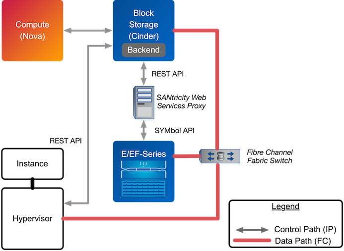

NetApp Driver for E-Series
==========================

NetApp Driver for E-Series with iSCSI
-------------------------------------

The NetApp E-Series driver for Cinder was introduced in the Icehouse
release as a new storage family supported within the NetApp unified
driver framework. The E-Series driver provides OpenStack with access to
NetApp E-Series controllers for provisioning and maintaining OpenStack
block storage volumes that use the iSCSI protocol.

Deployment Topology
^^^^^^^^^^^^^^^^^^^

As described in the section called ":ref:`theory-op`", Cinder
with NetApp E-Series requires the use of the NetApp SANtricity Web
Services Proxy server deployed as an intermediary between Cinder and the
E-Series storage system. A common deployment topology with Cinder, Nova,
and an E-Series controller with the SANtricity Web Services Proxy can be
seen below in Figure 4.7, “Cinder & E-Series Deployment Topology”.

.. figure:: ../../images/cinder_eseries_deployment_topology.png
   :alt: Cinder & E-Series Deployment Topology
   :scale: 50

   Figure 4.7. Cinder & E-Series Deployment Topology

.. tip::

   Installation instructions for the NetApp SANtricity Web Services
   Proxy server are available for download at
   https://library.netapp.com/ecm/ecm_download_file/ECMLP2428355, and
   the User Guide is available for download at
   https://library.netapp.com/ecm/ecm_download_file/ECMLP2428357.

.. tip::

   The default http port for SANtricity Web Services Proxy is 8080.
   This port can be changed if necessary to avoid conflicts with
   another service, such as Swift. See Web Services Proxy documentation
   for instructions.

Dynamic disk pools (as described in the section called ":ref:`ef-series`")
and volume groups are the supported disk collection strategies when
utilizing the Cinder E-Series driver. For more information on the
capabilities of the E-Series storage systems, visit
http://support.netapp.com.

.. tip::

   While formally introduced in the Icehouse release of OpenStack,
   NetApp has backported the E-Series driver to the Grizzly and Havana
   releases of OpenStack, accessible at
   https://github.com/NetApp/cinder. Be sure to choose the branch from
   this repository that matches the release version of OpenStack you
   are deploying with.

.. important::

   The use of multipath and DM-MP are required when using the OpenStack
   Block Storage driver for E-Series. Ensure that all unconfigured
   iSCSI host ports on the E-Series array are disabled for both IPv4
   and IPv6 in order for multipath to function properly.

.. important::

   Cinder volumes provisioned through the E-Series driver will not be
   mapped to LUN 0, as LUN 0 is reserved for special use with E-Series
   arrays.

Configuration Options
^^^^^^^^^^^^^^^^^^^^^

To set up the NetApp E-Series driver for Cinder, the following stanza
should be added to the Cinder configuration file (``cinder.conf``)::

    [myESeriesBackend]
    volume_backend_name=myESeriesBackend
    volume_driver=cinder.volume.drivers.netapp.common.NetAppDriver
    netapp_server_hostname=hostname
    netapp_server_port=8080
    netapp_transport_type=http

    netapp_storage_protocol=iscsi
    netapp_storage_family=eseries
    netapp_controller_ips=1.2.3.4,1.2.3.5
    netapp_sa_password=storage_array_password
    netapp_pool_name_search_pattern=(.+)
    netapp_login=admin_username
    netapp_password=admin_password
    use_multipath_for_image_xfer=True
    max_oversubscription_ratio=1.0
    reserved_percentage=5

-  Be sure that the value of the ``enabled_backends`` option in the
   ``[DEFAULT]`` stanza includes the name of the stanza you chose for
   the backend.

-  As the E-Series solution only provides block storage services, the
   value of ``netapp_storage_protocol`` MUST be set to ``iscsi`` or
   ``FC``.

-  The value of ``netapp_storage_family`` MUST be set to ``eseries``, as
   the default value for this option is ``ontap_cluster``.

.. important::

   In order for OpenStack Block Storage and OpenStack Compute to take
   advantage of multiple paths, the following configuration options
   must be correctly configured:

   -  The ``use_multipath_for_image_xfer`` should be set to ``True`` in
      ``cinder.conf`` within the driver stanza.

   -  The ``iscsi_use_multipath`` should be set to ``True`` in
      ``nova.conf`` within the ``[libvirt]`` stanza.

Table 4.19, “Configuration options for E-Series with iSCSI” below lists
the configuration options available for the unified driver for a E-Series
deployment that use the iSCSI storage protocol.

+---------------------------------------+------------+---------------------+------------------------------------------------------------------------------------------------------------------------------------------------------------------------------------------------------------------------------------------------------------------------------------------------------------------------------------------------------------------------------------------------------------------------------------------------------------------------------------------------------------------+
| Option                                | Type       | Default Value       | Description                                                                                                                                                                                                                                                                                                                                                                                                                                                                                                      |
+=======================================+============+=====================+==================================================================================================================================================================================================================================================================================================================================================================================================================================================================================================================+
| ``netapp_server_hostname``            | Required   |                     | The hostname or IP address for the proxy server.                                                                                                                                                                                                                                                                                                                                                                                                                                                                 |
+---------------------------------------+------------+---------------------+------------------------------------------------------------------------------------------------------------------------------------------------------------------------------------------------------------------------------------------------------------------------------------------------------------------------------------------------------------------------------------------------------------------------------------------------------------------------------------------------------------------+
| ``netapp_server_port``                | Optional   |                     | The TCP port to use for communication with the storage system or proxy server. If not specified, Data ONTAP drivers will use 80 for HTTP and 443 for HTTPS; E-Series will use 8080 for HTTP and 8443 for HTTPS.                                                                                                                                                                                                                                                                                                  |
+---------------------------------------+------------+---------------------+------------------------------------------------------------------------------------------------------------------------------------------------------------------------------------------------------------------------------------------------------------------------------------------------------------------------------------------------------------------------------------------------------------------------------------------------------------------------------------------------------------------+
| ``netapp_login``                      | Required   |                     | Administrative user account name used to access the proxy server.                                                                                                                                                                                                                                                                                                                                                                                                                                                |
+---------------------------------------+------------+---------------------+------------------------------------------------------------------------------------------------------------------------------------------------------------------------------------------------------------------------------------------------------------------------------------------------------------------------------------------------------------------------------------------------------------------------------------------------------------------------------------------------------------------+
| ``netapp_password``                   | Required   |                     | Password for the administrative user account specified in the ``netapp_login`` option.                                                                                                                                                                                                                                                                                                                                                                                                                           |
+---------------------------------------+------------+---------------------+------------------------------------------------------------------------------------------------------------------------------------------------------------------------------------------------------------------------------------------------------------------------------------------------------------------------------------------------------------------------------------------------------------------------------------------------------------------------------------------------------------------+
| ``netapp_storage_protocol``           | Required   |                     | The storage protocol to be used. Valid options are ``nfs``, ``iscsi`` or ``FC``.                                                                                                                                                                                                                                                                                                                                                                                                                                 |
+---------------------------------------+------------+---------------------+------------------------------------------------------------------------------------------------------------------------------------------------------------------------------------------------------------------------------------------------------------------------------------------------------------------------------------------------------------------------------------------------------------------------------------------------------------------------------------------------------------------+
| ``netapp_transport_type``             | Required   | ``http``            | Transport protocol for communicating with the proxy server. Valid options include ``http`` and ``https``.                                                                                                                                                                                                                                                                                                                                                                                                        |
+---------------------------------------+------------+---------------------+------------------------------------------------------------------------------------------------------------------------------------------------------------------------------------------------------------------------------------------------------------------------------------------------------------------------------------------------------------------------------------------------------------------------------------------------------------------------------------------------------------------+
| ``netapp_webservice_path``            | Optional   | ``/devmgr/v2``      | This option is used to specify the path to the E-Series proxy application on a proxy server. The value is combined with the value of the ``netapp_transport_type``, ``netapp_server_hostname``, and ``netapp_server_port`` options to create the URL used by the driver to connect to the proxy application.                                                                                                                                                                                                     |
+---------------------------------------+------------+---------------------+------------------------------------------------------------------------------------------------------------------------------------------------------------------------------------------------------------------------------------------------------------------------------------------------------------------------------------------------------------------------------------------------------------------------------------------------------------------------------------------------------------------+
| ``netapp_controller_ips``             | Required   |                     | This option is only utilized when the storage family is configured to ``eseries``. This option is used to restrict provisioning to the specified controllers. Specify the value of this option to be a comma separated list of controller management hostnames or IP addresses to be used for provisioning.                                                                                                                                                                                                      |
+---------------------------------------+------------+---------------------+------------------------------------------------------------------------------------------------------------------------------------------------------------------------------------------------------------------------------------------------------------------------------------------------------------------------------------------------------------------------------------------------------------------------------------------------------------------------------------------------------------------+
| ``netapp_sa_password``                | Optional   |                     | Password for the NetApp E-Series storage array.                                                                                                                                                                                                                                                                                                                                                                                                                                                                  |
+---------------------------------------+------------+---------------------+------------------------------------------------------------------------------------------------------------------------------------------------------------------------------------------------------------------------------------------------------------------------------------------------------------------------------------------------------------------------------------------------------------------------------------------------------------------------------------------------------------------+
| ``netapp_pool_name_search_pattern``   | Optional   | ``(.+)``            | This option is used to restrict provisioning to the specified pools. Specify the value of this option to be a regular expression which will be applied to the names of pools from the ``eseries`` storage backend.                                                                                                                                                                                                                                                                                               |
+---------------------------------------+------------+---------------------+------------------------------------------------------------------------------------------------------------------------------------------------------------------------------------------------------------------------------------------------------------------------------------------------------------------------------------------------------------------------------------------------------------------------------------------------------------------------------------------------------------------+
| ``netapp_storage_family``             | Required   | ``ontap_cluster``   | The storage family type used on the storage system; valid values are ``ontap_7mode`` for Data ONTAP operating in 7-Mode, ``ontap_cluster`` for clustered Data ONTAP, or ``eseries`` for E-Series.                                                                                                                                                                                                                                                                                                                |
+---------------------------------------+------------+---------------------+------------------------------------------------------------------------------------------------------------------------------------------------------------------------------------------------------------------------------------------------------------------------------------------------------------------------------------------------------------------------------------------------------------------------------------------------------------------------------------------------------------------+
| ``netapp_host_type``                  | Optional   | ``linux_dm_mp``     | This option defines the type of operating system for all initiators that can access a LUN. This information is used when mapping LUNs to individual hosts or groups of hosts. Refer to :ref:`Table 4.21, “Values for specifying host type OS for E-Series Storage Systems”<table-4.21>` for available options.                                                                                                                                                                                                   |
+---------------------------------------+------------+---------------------+------------------------------------------------------------------------------------------------------------------------------------------------------------------------------------------------------------------------------------------------------------------------------------------------------------------------------------------------------------------------------------------------------------------------------------------------------------------------------------------------------------------+
| ``netapp_enable_multiattach``         | Optional   | ``false``           | This option specifies whether the driver should allow operations that require multiple attachments to a volume. An example would be live migration of servers that have volumes attached. When enabled, this backend is limited to 256 total volumes in order to guarantee volumes can be accessed by more than one host. More information can be found here: :ref:`nova-live`                                                                                                                                   |
+---------------------------------------+------------+---------------------+------------------------------------------------------------------------------------------------------------------------------------------------------------------------------------------------------------------------------------------------------------------------------------------------------------------------------------------------------------------------------------------------------------------------------------------------------------------------------------------------------------------+
| ``reserved_percentage``               | Optional   | ``0``               | This option represents the amount of total capacity of a storage pool that will be reserved and cannot be utilized for provisioning Cinder volumes.                                                                                                                                                                                                                                                                                                                                                              |
+---------------------------------------+------------+---------------------+------------------------------------------------------------------------------------------------------------------------------------------------------------------------------------------------------------------------------------------------------------------------------------------------------------------------------------------------------------------------------------------------------------------------------------------------------------------------------------------------------------------+
| ``max_oversubscription_ratio``        | Optional   | ``20.0``            | This option is defined as a float, and specifies the amount of over-provisioning to allow when thin provisioning is being used in the storage pool. A value of 1.0 will mean that the provisioned capacity will not be able to exceed the total capacity, while larger values will result in increased levels of allowed over-provisioning.                                                                                                                                                                      |
+---------------------------------------+------------+---------------------+------------------------------------------------------------------------------------------------------------------------------------------------------------------------------------------------------------------------------------------------------------------------------------------------------------------------------------------------------------------------------------------------------------------------------------------------------------------------------------------------------------------+
| ``netapp_pool_name_search_pattern``   | Optional   | ``(.+)``            | This option is only utilized when the Cinder driver is configured to use iSCSI or Fibre Channel. It is used to restrict provisioning to the specified volume groups or disk pools. Specify the value of this option as a regular expression which will be applied to the names of volume groups or disk pools from the storage backend which represent pools in Cinder. ``^`` (beginning of string) and ``$`` (end of string) are implicitly wrapped around the regular expression specified before filtering.   |
+---------------------------------------+------------+---------------------+------------------------------------------------------------------------------------------------------------------------------------------------------------------------------------------------------------------------------------------------------------------------------------------------------------------------------------------------------------------------------------------------------------------------------------------------------------------------------------------------------------------+
| ``use_chap_auth``                     | Optional   |                     | This option is defined as a boolean, and specifies if unidirectional CHAP is enabled. Provides authenticated communication between iSCSI initiators and targets.                                                                                                                                                                                                                                                                                                                                                 |
+---------------------------------------+------------+---------------------+------------------------------------------------------------------------------------------------------------------------------------------------------------------------------------------------------------------------------------------------------------------------------------------------------------------------------------------------------------------------------------------------------------------------------------------------------------------------------------------------------------------+

Table 4.19. Configuration options for E-Series with iSCSI

NetApp Driver for E-Series with Fibre Channel
---------------------------------------------

The NetApp E-Series driver for Cinder was introduced in the Icehouse
release as a new storage family supported within the NetApp unified
driver framework. The Liberty release has added Fibre Channel support in
addition to iSCSI which has been supported since Icehouse. The E-Series
driver provides OpenStack with access to NetApp E-Series controllers for
provisioning and maintaining OpenStack block storage volumes that use
the Fibre Channel protocol. In order for Fibre Channel to be set up
correctly, you also need to set up Fibre Channel zoning for your
backends. See the section called :ref:`fc-switch` for more details on
configuring Fibre Channel zoning.

Deployment Topology
^^^^^^^^^^^^^^^^^^^

As described in the section called ":ref:`theory-op`", Cinder
with NetApp E-Series requires the use of the NetApp SANtricity Web
Services Proxy server deployed as an intermediary between Cinder and the
E-Series storage system. A common deployment topology with Cinder, Nova,
and an E-Series controller with the SANtricity Web Services Proxy can be
seen below in Figure 4.8, “Cinder & E-Series Deployment Topology”.

   Figure 4.8. Cinder & E-Series Deployment Topology

.. tip::

   Installation instructions for the NetApp SANtricity Web Services
   Proxy server are available for download at
   https://library.netapp.com/ecm/ecm_download_file/ECMLP2428355, and
   the User Guide is available for download at
   https://library.netapp.com/ecm/ecm_download_file/ECMLP2428357.

Dynamic disk pools (as described in the section called ":ref:`ef-series`) and
volume groups are the supported disk collection strategies when
utilizing the Cinder E-Series driver. For more information on the
capabilities of the E-Series storage systems, visit
http://support.netapp.com.

.. important::

   The use of multipath and DM-MP are required when using the OpenStack
   Block Storage driver for E-Series.

Configuration Options
^^^^^^^^^^^^^^^^^^^^^

To set up the NetApp E-Series driver for Cinder, the following stanza
should be added to the Cinder configuration file (``cinder.conf``)::

    [myESeriesBackend]
    volume_backend_name=myESeriesBackend
    volume_driver=cinder.volume.drivers.netapp.common.NetAppDriver
    netapp_server_hostname=hostname
    netapp_server_port=8080
    netapp_transport_type=http
    netapp_storage_protocol=fc
    netapp_storage_family=eseries
    netapp_controller_ips=1.2.3.4,1.2.3.5
    netapp_sa_password=storage_array_password
    netapp_pool_name_search_pattern=(.+)
    netapp_login=admin_username
    netapp_password=admin_password
    use_multipath_for_image_xfer=True
    max_oversubscription_ratio=1.0
    reserved_percentage=5

-  Be sure that the value of the ``enabled_backends`` option in the
   ``[DEFAULT]`` stanza includes the name of the stanza you chose for
   the backend.

-  The value of ``netapp_storage_protocol`` MUST be set to ``fc``.

-  The value of ``netapp_storage_family`` MUST be set to ``eseries``, as
   the default value for this option is ``ontap_cluster``.

.. important::

   In order for Fibre Channel to be set up correctly, you also need to
   set up Fibre Channel zoning for your backends. See
   `??? <#cinder.fc_zoning>`__ for more details on configuring Fibre
   Channel zoning.

.. important::

   In order for OpenStack Block Storage and OpenStack Compute to take
   advantage of multiple paths, the following configuration options
   must be correctly configured:

   -  The ``use_multipath_for_image_xfer`` should be set to ``True`` in
      ``cinder.conf`` within the driver stanza.

Table 4.20, “Configuration options for E-Series with Fibre Channel” below lists the configuration
options available for the unified driver for a E-Series deployment that
use the Fibre Channel storage protocol.

+---------------------------------------+------------+---------------------+------------------------------------------------------------------------------------------------------------------------------------------------------------------------------------------------------------------------------------------------------------------------------------------------------------------------------------------------------------------------------------------------------------------------------------------------------------------------------------------------------------------------------------------------------------------------------------------------------------------------------------------------------------------------------------------------------------------------------------+
| Option                                | Type       | Default Value       | Description                                                                                                                                                                                                                                                                                                                                                                                                                                                                                                                                                                                                                                                                                                                        |
+=======================================+============+=====================+====================================================================================================================================================================================================================================================================================================================================================================================================================================================================================================================================================================================================================================================================================================================================+
| ``netapp_server_hostname``            | Required   |                     | The hostname or IP address for the proxy server.                                                                                                                                                                                                                                                                                                                                                                                                                                                                                                                                                                                                                                                                                   |
+---------------------------------------+------------+---------------------+------------------------------------------------------------------------------------------------------------------------------------------------------------------------------------------------------------------------------------------------------------------------------------------------------------------------------------------------------------------------------------------------------------------------------------------------------------------------------------------------------------------------------------------------------------------------------------------------------------------------------------------------------------------------------------------------------------------------------------+
| ``netapp_server_port``                | Optional   |                     | The TCP port to use for communication with the storage system or proxy server. If not specified, Data ONTAP drivers will use 80 for HTTP and 443 for HTTPS; E-Series will use 8080 for HTTP and 8443 for HTTPS.                                                                                                                                                                                                                                                                                                                                                                                                                                                                                                                    |
+---------------------------------------+------------+---------------------+------------------------------------------------------------------------------------------------------------------------------------------------------------------------------------------------------------------------------------------------------------------------------------------------------------------------------------------------------------------------------------------------------------------------------------------------------------------------------------------------------------------------------------------------------------------------------------------------------------------------------------------------------------------------------------------------------------------------------------+
| ``netapp_login``                      | Required   |                     | Administrative user account name used to access the proxy server.                                                                                                                                                                                                                                                                                                                                                                                                                                                                                                                                                                                                                                                                  |
+---------------------------------------+------------+---------------------+------------------------------------------------------------------------------------------------------------------------------------------------------------------------------------------------------------------------------------------------------------------------------------------------------------------------------------------------------------------------------------------------------------------------------------------------------------------------------------------------------------------------------------------------------------------------------------------------------------------------------------------------------------------------------------------------------------------------------------+
| ``netapp_password``                   | Required   |                     | Password for the administrative user account specified in the ``netapp_login`` option.                                                                                                                                                                                                                                                                                                                                                                                                                                                                                                                                                                                                                                             |
+---------------------------------------+------------+---------------------+------------------------------------------------------------------------------------------------------------------------------------------------------------------------------------------------------------------------------------------------------------------------------------------------------------------------------------------------------------------------------------------------------------------------------------------------------------------------------------------------------------------------------------------------------------------------------------------------------------------------------------------------------------------------------------------------------------------------------------+
| ``netapp_storage_protocol``           | Required   |                     | The storage protocol to be used. Valid options are ``fc`` or ``iscsi``.                                                                                                                                                                                                                                                                                                                                                                                                                                                                                                                                                                                                                                                            |
+---------------------------------------+------------+---------------------+------------------------------------------------------------------------------------------------------------------------------------------------------------------------------------------------------------------------------------------------------------------------------------------------------------------------------------------------------------------------------------------------------------------------------------------------------------------------------------------------------------------------------------------------------------------------------------------------------------------------------------------------------------------------------------------------------------------------------------+
| ``netapp_transport_type``             | Required   | ``http``            | Transport protocol for communicating with the proxy server. Valid options include ``http`` and ``https``.                                                                                                                                                                                                                                                                                                                                                                                                                                                                                                                                                                                                                          |
+---------------------------------------+------------+---------------------+------------------------------------------------------------------------------------------------------------------------------------------------------------------------------------------------------------------------------------------------------------------------------------------------------------------------------------------------------------------------------------------------------------------------------------------------------------------------------------------------------------------------------------------------------------------------------------------------------------------------------------------------------------------------------------------------------------------------------------+
| ``netapp_webservice_path``            | Optional   | ``/devmgr/v2``      | This option is used to specify the path to the E-Series proxy application on a proxy server. The value is combined with the value of the ``netapp_transport_type``, ``netapp_server_hostname``, and ``netapp_server_port`` options to create the URL used by the driver to connect to the proxy application.                                                                                                                                                                                                                                                                                                                                                                                                                       |
+---------------------------------------+------------+---------------------+------------------------------------------------------------------------------------------------------------------------------------------------------------------------------------------------------------------------------------------------------------------------------------------------------------------------------------------------------------------------------------------------------------------------------------------------------------------------------------------------------------------------------------------------------------------------------------------------------------------------------------------------------------------------------------------------------------------------------------+
| ``netapp_controller_ips``             | Required   |                     | This option is only utilized when the storage family is configured to ``eseries``. This option is used to restrict provisioning to the specified controllers. Specify the value of this option to be a comma separated list of controller management hostnames or IP addresses to be used for provisioning.                                                                                                                                                                                                                                                                                                                                                                                                                        |
+---------------------------------------+------------+---------------------+------------------------------------------------------------------------------------------------------------------------------------------------------------------------------------------------------------------------------------------------------------------------------------------------------------------------------------------------------------------------------------------------------------------------------------------------------------------------------------------------------------------------------------------------------------------------------------------------------------------------------------------------------------------------------------------------------------------------------------+
| ``netapp_sa_password``                | Optional   |                     | Password for the NetApp E-Series storage array.                                                                                                                                                                                                                                                                                                                                                                                                                                                                                                                                                                                                                                                                                    |
+---------------------------------------+------------+---------------------+------------------------------------------------------------------------------------------------------------------------------------------------------------------------------------------------------------------------------------------------------------------------------------------------------------------------------------------------------------------------------------------------------------------------------------------------------------------------------------------------------------------------------------------------------------------------------------------------------------------------------------------------------------------------------------------------------------------------------------+
| ``netapp_pool_name_search_pattern``   | Optional   | ``(.+)``            | This option is used to restrict provisioning to the specified pools. Specify the value of this option to be a regular expression which will be applied to the names of pools from the ``eseries`` storage backend. The option is only utilized when the Cinder driver is configured to use iSCSI or Fibre Channel. It is used to restrict provisioning to the specified volume groups or disk pools. Specify the value of this option as a regular expression which will be applied to the names of volume groups or disk pools from the storage backend which represent pools in Cinder. ``^`` (beginning of string) and ``$`` (end of string) are implicitly wrapped around the regular expression specified before filtering.   |
+---------------------------------------+------------+---------------------+------------------------------------------------------------------------------------------------------------------------------------------------------------------------------------------------------------------------------------------------------------------------------------------------------------------------------------------------------------------------------------------------------------------------------------------------------------------------------------------------------------------------------------------------------------------------------------------------------------------------------------------------------------------------------------------------------------------------------------+
| ``netapp_storage_family``             | Required   | ``ontap_cluster``   | The storage family type used on the storage system; valid values are ``ontap_7mode`` for Data ONTAP operating in 7-Mode, ``ontap_cluster`` for clustered Data ONTAP, or ``eseries`` for E-Series.                                                                                                                                                                                                                                                                                                                                                                                                                                                                                                                                  |
+---------------------------------------+------------+---------------------+------------------------------------------------------------------------------------------------------------------------------------------------------------------------------------------------------------------------------------------------------------------------------------------------------------------------------------------------------------------------------------------------------------------------------------------------------------------------------------------------------------------------------------------------------------------------------------------------------------------------------------------------------------------------------------------------------------------------------------+
| ``netapp_host_type``                  | Optional   | ``linux_dm_mp``     | This option defines the type of operating system for all initiators that can access a LUN. This information is used when mapping LUNs to individual hosts or groups of hosts. Refer to `table\_title <#cinder.eseries.hosttype>`__ for available options.                                                                                                                                                                                                                                                                                                                                                                                                                                                                          |
+---------------------------------------+------------+---------------------+------------------------------------------------------------------------------------------------------------------------------------------------------------------------------------------------------------------------------------------------------------------------------------------------------------------------------------------------------------------------------------------------------------------------------------------------------------------------------------------------------------------------------------------------------------------------------------------------------------------------------------------------------------------------------------------------------------------------------------+
| ``netapp_enable_multiattach``         | Optional   | ``false``           | This option specifies whether the driver should allow operations that require multiple attachments to a volume. An example would be live migration of servers that have volumes attached. When enabled, this backend is limited to 256 total volumes in order to guarantee volumes can be accessed by more than one host. More information can be found here: `simplesect\_title <#cinder.eseries.configuration.live_migration>`__                                                                                                                                                                                                                                                                                                 |
+---------------------------------------+------------+---------------------+------------------------------------------------------------------------------------------------------------------------------------------------------------------------------------------------------------------------------------------------------------------------------------------------------------------------------------------------------------------------------------------------------------------------------------------------------------------------------------------------------------------------------------------------------------------------------------------------------------------------------------------------------------------------------------------------------------------------------------+
| ``reserved_percentage``               | Optional   | ``0``               | This option represents the amount of total capacity of a storage pool that will be reserved and cannot be utilized for provisioning Cinder volumes.                                                                                                                                                                                                                                                                                                                                                                                                                                                                                                                                                                                |
+---------------------------------------+------------+---------------------+------------------------------------------------------------------------------------------------------------------------------------------------------------------------------------------------------------------------------------------------------------------------------------------------------------------------------------------------------------------------------------------------------------------------------------------------------------------------------------------------------------------------------------------------------------------------------------------------------------------------------------------------------------------------------------------------------------------------------------+
| ``max_oversubscription_ratio``        | Optional   | ``20.0``            | This option is defined as a float, and specifies the amount of over-provisioning to allow when thin provisioning is being used in the storage pool. A value of 1.0 will mean that the provisioned capacity will not be able to exceed the total capacity, while larger values will result in increased levels of allowed over-provisioning.                                                                                                                                                                                                                                                                                                                                                                                        |
+---------------------------------------+------------+---------------------+------------------------------------------------------------------------------------------------------------------------------------------------------------------------------------------------------------------------------------------------------------------------------------------------------------------------------------------------------------------------------------------------------------------------------------------------------------------------------------------------------------------------------------------------------------------------------------------------------------------------------------------------------------------------------------------------------------------------------------+

Table 4.20. Configuration options for E-Series with Fibre Channel

|

.. _table-4.21:

+----------------------------------+------------------------------------------------------+
| Value for ``netapp_host_type``   | Operating System                                     |
+==================================+======================================================+
| aix                              | AIX MPIO                                             |
+----------------------------------+------------------------------------------------------+
| avt                              | AVT\_4M                                              |
+----------------------------------+------------------------------------------------------+
| factoryDefault                   | Factory Default                                      |
+----------------------------------+------------------------------------------------------+
| hpux                             | HP-UX                                                |
+----------------------------------+------------------------------------------------------+
| linux\_atto                      | Linux (ATTO)                                         |
+----------------------------------+------------------------------------------------------+
| linux\_dm\_mp                    | Linux (DM-MP)                                        |
+----------------------------------+------------------------------------------------------+
| linux\_mpp\_rdac                 | Linux (MPP/RDAC)                                     |
+----------------------------------+------------------------------------------------------+
| linux\_pathmanager               | Linux (Pathmanager)                                  |
+----------------------------------+------------------------------------------------------+
| macos                            | Mac OS                                               |
+----------------------------------+------------------------------------------------------+
| ontap                            | NetApp Data ONTAP                                    |
+----------------------------------+------------------------------------------------------+
| svc                              | SVC                                                  |
+----------------------------------+------------------------------------------------------+
| solaris\_v11                     | Solaris (v11 or later)                               |
+----------------------------------+------------------------------------------------------+
| solaris\_v10                     | Solaris (version 10 or earlier)                      |
+----------------------------------+------------------------------------------------------+
| vmware                           | VMware                                               |
+----------------------------------+------------------------------------------------------+
| windows                          | Windows 2000/Server 2003/Server 2008 Non-Clustered   |
+----------------------------------+------------------------------------------------------+
| windows\_atto                    | Windows (ATTO)                                       |
+----------------------------------+------------------------------------------------------+
| windows\_clustered               | Windows 2000/Server 2003/Server 2008 Clustered       |
+----------------------------------+------------------------------------------------------+

Table 4.21. Values for specifying host type OS for E-Series Storage Systems
