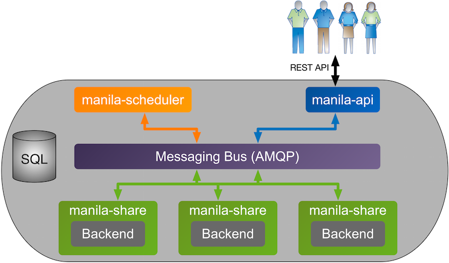
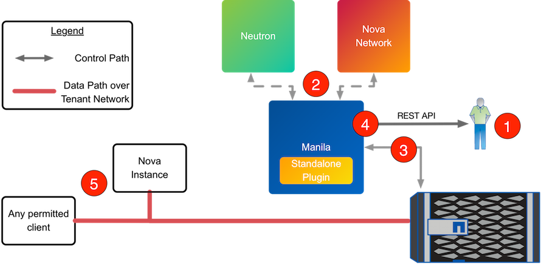
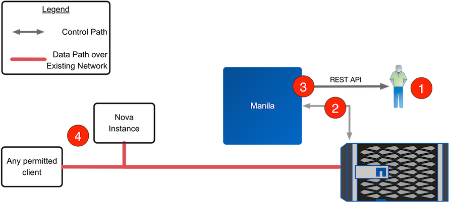

Process Structure
=================

There are three processes that make up the Manila service:

-  ``manila-api`` is a WSGI application that accepts and validates REST
   (JSON) requests from clients and routes them to other Manila
   processes as appropriate over AMQP.

-  ``manila-scheduler`` determines which backend should serve as the
   destination for a share creation request. It maintains non-persistent
   state for pools and backends (e.g. available capacity, capabilities,
   and supported extra specs) that can be leveraged when making
   placement decisions. The algorithm utilized by the scheduler can be
   changed through Manila configuration.

-  ``manila-share`` accepts requests from other Manila processes and
   serves as the operational container for Manila drivers. This process
   is multi-threaded and typically has one thread of execution per
   Manila backend as defined in the Manila configuration file.

   Manila Processes Concept Diagram

The following section walks through the steps that occur when a user
requests the creation of a new share from Manila, and a backend is
selected that uses share servers.

   Manila Workflow - Share Creation with Share Servers

1. Client issues request to create share through invoking REST API
   (client may use ``python-manilaclient`` CLI utility).

   The ``manila-api`` and ``manila-scheduler`` processes perform the
   following tasks:

   1. ``manila-api`` process validates request, user credentials; once
      validated, puts message onto AMQP queue for processing.

   2. ``manila-share`` process takes message off of queue, sends message
      to manila-scheduler to determine which pool and backend to
      provision share into.

   3. ``manila-scheduler`` process takes message off of queue, generates
      candidate list of resource pools based on current state and
      requested share criteria (size, availability zone, share type
      (including extra specs)).

   4. ``manila-share`` process reads response message from
      ``manila-scheduler`` from queue; iterates through candidate list
      by invoking backend driver methods for corresponding pools until
      successful.

2. The share manager associated with the backend selected by the
   ``manila-scheduler`` calls out to the network service associated with
   the backend (either the standalone plugin, Neutron, or Nova Network;
   defined through the appropriate stanza in ``manila.conf``) to get the
   required information (including share IP address, network
   segmentation ID, etc.).

3. If selected by the scheduler, NetApp's Manila driver creates
   requested share (and, if necessary, a share server) through
   interactions with storage subsystem (dependent on configuration and
   protocol).

4. ``manila-share`` process creates share metadata and posts response
   message to AMQP queue.

   ``manila-api`` process reads response message from queue and responds
   to client with share ID information.

5. After a share is created and exported by the backend, client uses ID
   information to request updated share details and uses export
   information from response to mount share (using protocol-specific
   commands).

The following section walks through the steps that occur when a user
requests the creation of a new share from Manila and a backend is
selected that does not use share servers.

   Manila Workflow - Share Creation without Share Servers

1. Client issues request to create share through invoking REST API
   (client may use ``python-manilaclient`` CLI utility).

   The ``manila-api`` and ``manila-scheduler`` processes perform the
   following tasks:

   1. ``manila-api`` process validates request, user credentials; once
      validated, puts message onto AMQP queue for processing.

   2. ``manila-share`` process takes message off of queue, sends message
      to manila-scheduler to determine which pool and backend to
      provision share into.

   3. ``manila-scheduler`` process takes message off of queue, generates
      candidate list of resource pools based on current state and
      requested share criteria (size, availability zone, share type
      (including extra specs)).

   4. ``manila-share`` process reads response message from
      ``manila-scheduler`` from queue; iterates through candidate list
      by invoking backend driver methods for corresponding pools until
      successful.

2. If selected by the scheduler, NetApp's Manila driver creates
   requested share through interactions with storage subsystem
   (dependent on configuration and protocol).

   Without the existence of a share server, NetApp's Manila driver will
   export shares through the data LIFs that exist within the SVM that is
   scoped to the Manila backend.

3. ``manila-share`` process creates share metadata and posts response
   message to AMQP queue.

   ``manila-api`` process reads response message from queue and responds
   to client with share ID information.

4. After a share is created and exported by the backend, client uses ID
   information to request updated share details and uses export
   information from response to mount share (using protocol-specific
   commands).

The following section walks through the steps that are required in order
for any client to access a shared filesystem.

1. Client issues request to enable access to a share through invoking
   Manila REST API (client may use ``python-manilaclient`` CLI utility),
   specifying the type of access (either ``IP`` or ``user``) and the
   value (either IP address or IP network address in CIDR notation or
   user name in standard Windows notation).

2. ``manila-api`` process validates request, user credentials; once
   validated, posts message to share manager over AMQP.

3. ``manila-share`` reads message from queue, invokes Manila driver
   corresponding to share to be attached.

4. NetApp Manila driver creates appropriate export policies for the
   share and access type provided.

5. ``manila-share`` process posts response information to ``manila-api``
   process via AMQP queue.

6. ``manila-api`` process reads response message from ``manila-share``
   from queue; passes connection information in RESTful response to
   caller.
