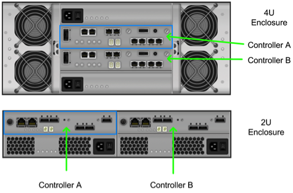

Swift Zones and NetApp E-Series Storage
=======================================

Swift uses zoning to isolate the cluster into separate partitions to
isolate the cluster from failures. Swift data is replicated across the
cluster in zones that are as unique as possible. A zone is an arbitrary
grouping of nodes; typically zones are established that use physical
attributes of the cluster, such as geographical locations, separate
networks, equipment racks, storage subsystems, or even single drives.
Zoning allows the cluster to tolerate equipment failures within the
cluster without data loss or loss of connectivity to the remaining
cluster.

By default, Swift replicates data 3 times across the cluster. Swift
replicates data across zones in a unique pattern that attempts to ensure
high availability and high durability for data. Swift chooses to place a
replica of data in a server in an unused zone before placing it into an
unused server in a zone that already has a replica of the data.

The data reconstruction feature of E-Series ensures that clients always
have access to their data - regardless of drive or other component
failures within the storage subsystem. When E-Series storage is used
Swift data replication counts specified when rings are built can be
reduced from 3 to 1.

E-Series storage offers flexible configuration options that satisfy
practically all Swift zoning requirements. DDP reconstruction also
eliminates the requirement of Swift data replication within a single
storage array. Zoning based on E-Series storage can be done on a storage
subsystem, individual controller, or drive tray basis.

Controller-subsystem Based Zoning
---------------------------------

In a cluster that contains several E-Series storage subsystems zoning
may be done through the use of 1 or more E-Series subsystems as a zone.
An example of this is shown in
Figure 8.2, “Controller-subsystem based zoning”.

.. figure:: ../images/swift_controller_subsystem_zoning.png
   :alt: Controller-subsystem based zoning

   Figure 8.2. Controller-subsystem based zoning

Controller Based Zoning
-----------------------

E-Series storage subsystems contain two independently configurable
controller modules (shown in
Figure 8.3, “E-Series Controller Layout”) which in turn communicate
with drives contained within the storage subsystem and optionally other
externally attached E-Series drive enclosures.

   Figure 8.3. E-Series Controller Layout

For controller based zoning, each E-Series storage controller supports 2
Swift object storage nodes. Each node is connected to a single
controller in the storage array. LUNs for each Swift node are configured
separately on drives located within the enclosure. Additional drive
enclosures may also be attached to the controller module for added
storage capacity.

Drive-tray or Enclosure-based Zoning
------------------------------------

If Swift cluster requirements require unique zones for each object node
E-Series storage arrays can effectively provide storage capacity for
multiple Swift object nodes. Disk pools are created according to desired
capacity. Individual drives which comprise a disk pool are preselected
by the system. Automated drive selection helps ensure that:

-  Subsystem I/O performance is maximized.

-  The impact of hardware failures within a drive enclosure or tray is
   minimized.

-  I/O load on the subsystem is distributed as evenly as possible across
   all the drive channels in the subsystem.

If unique zoning is not required, node connectivity is only limited by
the host connectivity capacity of the E-Series storage subsystem being
used.
